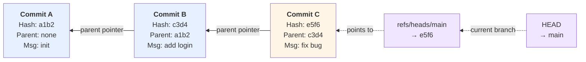
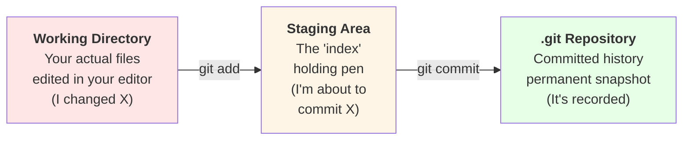
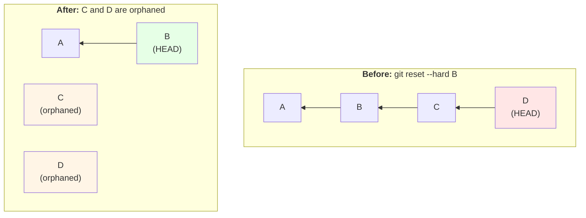
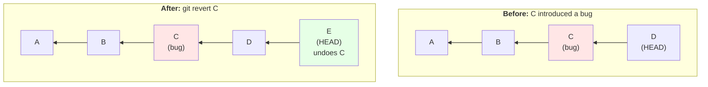
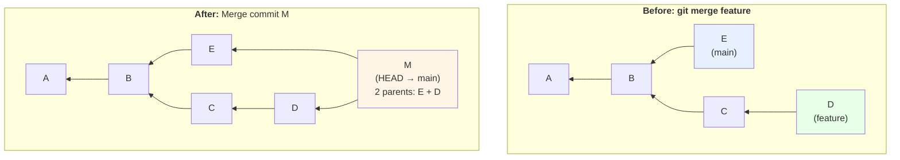
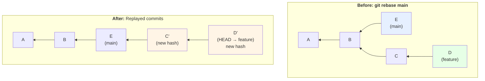
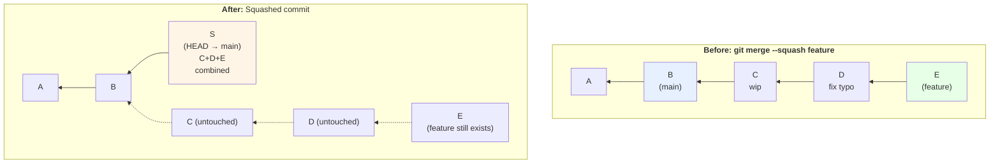
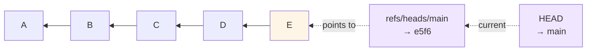

# Version Control Systems: The Git Deep Dive
---

## 📌 Executive Summary: The Big Picture

Every time you save a file, you overwrite the old version. It's gone. If you break something at 2am and can't remember what it looked like yesterday, you're stuck.

**Version Control Systems (VCS)** solve this: they keep a full history of every change, who made it, when, and why — and let you jump back to any point in time.

**Git** is a **distributed VCS**. "Distributed" is the key word — unlike older systems where history lived only on one central server, with Git **every clone has the entire history**. Your laptop has the same complete project history as the server. No single point of failure, and you can work fully offline.

> **Git's job, in one sentence:** "Take snapshots of your project over time, and let you move between them safely."

**GitHub, GitLab, Bitbucket** are not Git. They are **hosting platforms** — websites that store a copy of your Git repository in the cloud so a team can share it, add pull requests, issues, and CI/CD on top. Git works perfectly fine with zero internet connection; GitHub is just the "meeting place" for pushing/pulling.

---

## 🧠 Core Story: The Photo Album vs. the Highlight Reel

Imagine you're building a LEGO castle over several weekends.

- **Without version control:** You keep modifying the same physical castle. If you mess up week 4's tower, there's no way back to week 3's version — it's already been dismantled.
- **With Git:** Every time you finish a meaningful chunk of building, you take a **snapshot photo** (a **commit**). Each photo is timestamped, labeled ("added north tower"), and — critically — **each photo remembers which photo came right before it**.

Flip through the album backwards, and you can walk from "finished castle" all the way back to "just the baseplate," one photo at a time. That backward chain of photos, each pointing to its predecessor, is the entire mental model of Git history.

Now scale this up: multiple builders (**branches**), working on different wings of the castle simultaneously, occasionally combining their work into one shared timeline (**merging**).

---

## 🏗️ What is a VCS (Version Control System)?

A **VCS** is a tool that records changes to files over time, so you can:

- **Recall** any earlier version of a file or project.
- **Compare** changes between versions (`diff`).
- **Collaborate** — multiple people editing the same codebase without overwriting each other's work.
- **Attribute** — know exactly who changed what line, and when.
- **Revert** — undo a bad change without losing everything after it.

### Types of VCS

| Type | How it works | Examples |
|---|---|---|
| **Local VCS** | A simple database on your own machine tracking file changes | RCS |
| **Centralized VCS (CVCS)** | One central server holds the *only* full history. Clients check out files from it. | SVN, Perforce, CVS |
| **Distributed VCS (DVCS)** | Every client has a **full copy** of the entire history, not just the latest files | **Git**, Mercurial |

**Why distributed won:** In a CVCS, if the central server goes down, nobody can commit, view history, or do anything except edit files locally. In Git, your local clone already has 100% of history — you can commit, branch, view logs, and diff entirely offline. You only need the network when you want to **sync** with others (`push`/`pull`).

### VCS Remotes / Hosting Platforms

Git itself has no concept of "the cloud." A **remote** is just another copy of the repository — it could be a folder on a USB stick, a server in your office, or a hosted platform. In practice, teams use hosted platforms to make sharing painless:

| Platform | What it adds on top of Git |
|---|---|
| **GitHub** | Hosting, Pull Requests, Issues, Actions (CI/CD), code review UI |
| **GitLab** | Hosting, Merge Requests, built-in CI/CD pipelines, self-hostable |
| **Bitbucket** | Hosting, tight Jira integration, Pipelines (CI/CD) |

None of these *are* Git — they're **remote servers running Git**, wrapped in a web UI and extra collaboration tooling (PRs, code review, issue tracking).

### `git clone` vs. `git fork` — Understanding the Difference

These two concepts are often confused because they both create a copy of a repository, but they work at **completely different levels**:

| | **Clone** | **Fork** |
|---|---|---|
| **What it is** | A Git command (local operation) | A GitHub feature (server-side operation) |
| **What it does** | Downloads a repo's full history to your machine | Creates your own copy of a repo under your GitHub account |
| **Where it copies** | Remote → Your machine | Remote → Your GitHub account |
| **Relationship to original** | Direct connection via `origin` remote | Independent, but can sync via `upstream` |
| **Used for** | Contributing to repos you have write access to | Contributing to repos you don't own |
| **Commits go where** | Back to the original repo (if you have push access) | Stay in your fork unless you open a PR |

**Clone: Getting code to your computer**

```bash
git clone https://github.com/someuser/repo.git
```

This runs on your **local machine**. It downloads the entire repository (all history, all branches) from the remote server and creates a `.git` folder on your computer. After cloning, your local Git knows about `origin` (the remote you cloned from), and you can push/pull from it *only if you have write access*.

**Use clone when:**
- You're a team member with write access to the repo
- You're working on an open-source repo where you've been granted contributor status
- You just want a local copy of code to work with

**Fork: Creating your own server-side copy**

Forking happens **entirely on GitHub** (or GitLab, etc.) — it's not a Git command. When you click "Fork" on a repo you don't own, GitHub creates a new repository under *your* account that's a snapshot of the original.

```bash
# After forking on GitHub, you still need to clone it locally
git clone https://github.com/YOUR-USERNAME/repo.git
```

Now your local clone points to *your fork* (via `origin`), not the original repo. To stay in sync with the original repo's updates, you typically add an `upstream` remote:

```bash
git remote add upstream https://github.com/original-owner/repo.git
git fetch upstream        # download updates from the original
git rebase upstream/main  # replay your commits on top of the latest original
```

**Use fork when:**
- You want to contribute to a repo you don't have write access to
- You want to experiment without affecting the original repo
- You're planning to propose changes via a Pull Request to the original repo

**The typical GitHub contribution flow:**

1. **Fork** the repo on GitHub (creates `your-username/repo`)
2. **Clone** your fork locally (`git clone https://github.com/your-username/repo.git`)
3. **Add upstream** remote to track the original (`git remote add upstream https://github.com/original-owner/repo.git`)
4. **Create a feature branch** on your local clone
5. **Commit** your changes
6. **Push** to your fork (`git push origin feature-branch`)
7. **Open a Pull Request** from your fork's branch to the original repo's main branch
8. **Maintainers review** and merge (or request changes)

**Key insight:** A fork is a GitHub concept (server-side), while clone is a Git concept (local). You can clone a repo you don't fork, but to contribute to a repo you don't own, you'll typically fork first, then clone your fork.

---

## 🔬 How Git Actually Stores Things: Anatomy of `.git`

Run `git init` in any folder, and Git creates a hidden `.git` directory. **This folder *is* the entire repository.** Delete it, and all history is gone — the files remain, but they're just files again, with no memory of anything.

```
your-project/
├── .git/                  ← the actual database. Everything lives here.
│   ├── HEAD               ← a pointer to your current branch
│   ├── config              ← repo-specific settings (remotes, user info, etc.)
│   ├── objects/             ← THE ACTUAL DATA. Every commit, file, and folder ever recorded.
│   ├── refs/
│   │   ├── heads/           ← your local branches (each is just a file containing a hash)
│   │   └── remotes/          ← tracking refs for remote branches
│   ├── logs/               ← history of where HEAD has pointed (reflog)
│   └── index                ← the staging area (a binary file)
└── your actual files (working directory)
```

### What Git Stores as a Snapshot (Not a Diff!)

A common misconception: people assume Git stores *diffs* (like "line 5 changed from X to Y") between versions, the way some older tools do.

**Git does not do this.** Every commit is a **full snapshot** of the entire project at that moment — Git just optimizes so unchanged files aren't duplicated. It stores four kinds of objects, all inside `.git/objects/`:

| Object type | What it holds |
|---|---|
| **blob** | The raw content of a single file (no filename, no metadata — just content) |
| **tree** | A snapshot of a directory: a list of filenames + which blob/tree each one points to |
| **commit** | A pointer to one tree (the project snapshot), plus metadata: author, date, message, and **parent commit hash** |
| **tag** | A named, fixed pointer to a specific commit (used for releases, e.g. `v1.0.0`) |

So a single commit is really: **commit → tree → (blobs + sub-trees)**, and every commit also points backward to its **parent commit** — that's the chain.

---

## 🔗 The Linked List: How Commits Point Backward

This is the single most important mental model in Git.

**Every commit stores the hash of its parent commit.** That's it. That's the whole trick. This means Git history is literally a **singly linked list** (a DAG — Directed Acyclic Graph — once branches/merges are involved, but a straight line most of the time):

<div style="background-color: #faf8f3; padding: 20px; border-radius: 8px; margin: 10px 0;">



</div>

**Key concepts (arrows point BACKWARD in time to parent commits):**

- **Each arrow points backward**: `C → B → A` means C's parent is B, B's parent is A. Visually (left-to-right) we show newest commits on the right and oldest on the left, but **the arrows point leftward (backward in time) to show the parent relationship**.
- **`HEAD`** is a pointer to whatever branch you're currently on (usually the file `.git/HEAD` containing `ref: refs/heads/main`).
- **`main`** (the branch) is itself just a pointer — a small file in `.git/refs/heads/main` — holding the hash of the latest commit (`e5f6`).
- When you make a new commit: (1) Git creates the new commit object with `parent = current HEAD's commit`, (2) moves the branch pointer forward (rightward on the timeline). The chain grows by one link.

**A timeline vs. pointer direction:**
- **Timeline direction (visual, left → right):** oldest commits on left, newest on right (how we naturally draw history).
- **Pointer direction (arrows):** backward to parent, so each commit points **left** (toward history) to its parent.

A **branch**, therefore, is nothing more than a movable pointer to a commit. This is why branching in Git is instant and cheap — you're not copying files, you're writing one tiny new file with a hash in it.

---

## 🗂️ Where Hashes Physically Live in `.git/objects/`

Every object (blob, tree, commit, tag) is identified by a **SHA-1 hash** (40 hex characters, e.g. `2a3fce8b9d1e4f5a6b7c8d9e0f1a2b3c4d5e6f70`) computed from its **content**. Same content → same hash, always. Change one byte → a completely different hash.

Storing 40-character-named files as 1,000,000 flat files in one folder would be painfully slow to browse. So Git splits the hash:

> **First 2 characters → folder name. Remaining 38 characters → filename inside that folder.**

So if you have hashes `2abce1234...` and `b543219876...`, they land here:

```
.git/objects/
├── 2a/
│   └── bce1234567890abcdef1234567890abcdef12   ← object for hash 2abce123...
├── b5/
│   └── 43219876543210fedcba9876543210fedcba98   ← object for hash b543219...
├── c3/
│   └── d4a1b2c3d4e5f60718293a4b5c6d7e8f9a0b1c2
└── ...
```

**Why `2a` and `b5` become their own folders:** Git takes the hash `2abce1234...`, uses `2a` as the directory name, and `bce1234...` (the remaining 38 chars) as the file name inside it. This is purely a filesystem-performance trick (avoiding one folder with millions of entries) — it has no bearing on Git's logic, only on how fast your OS can look things up.

**Inside a commit object specifically**, once decompressed (Git zlib-compresses every object), you'd see something like:

```
tree e5f6a1b2c3d4e5f6a1b2c3d4e5f6a1b2c3d4e5f6
parent c3d4a1b2c3d4a1b2c3d4a1b2c3d4a1b2c3d4a1b2
author Mohammed Saif <mohammed001saif@gmail.com> 1755417600 +0530
committer Mohammed Saif <mohammed001saif@gmail.com> 1755417600 +0530

fix bug in login flow
```

This confirms exactly what a commit stores: **its own tree (snapshot), its parent's hash, the author, the committer (can differ — e.g. after a rebase by someone else), a timestamp, and the message.** You can see this raw form yourself:

```bash
git cat-file -p <commit-hash>
```

---

## 🪜 The Staging Area (Index): The Middle Step Nobody Explains Well

Git has **three areas**, and understanding this trio clears up 90% of Git confusion:

<div style="background-color: #faf8f3; padding: 20px; border-radius: 8px; margin: 10px 0;">



</div>

**The three areas explained:**

- **Working Directory** — the files you see and edit in your editor right now.
- **Staging Area (`git add`)** — a holding pen. You choose *exactly* which changes go into the next commit, even if you've changed 10 files but only want to commit 2 of them, or even just part of one file (`git add -p`).
- **Repository (`git commit`)** — once committed, that staged snapshot becomes a permanent, hashed, linked-list entry in `.git/objects`.

**Why bother with a staging area at all?** It lets you build a commit deliberately instead of "whatever's currently on disk." You can stage half your changes, commit a focused "fix typo" commit, then stage and commit the rest separately — keeping history clean and reviewable, one logical change per commit.

---

## 🧭 Everyday Git Commands, Explained in Depth

### Setup & Inspection

```bash
git init                     # turn current folder into a Git repo (.git/ created)
git clone <url>               # copy a remote repo (all history) to your machine
git status                    # what's staged, unstaged, untracked right now
git diff                      # unstaged changes vs. last commit
git diff --staged             # staged changes vs. last commit
```

**First-time Git setup (configure your identity):**

Git tracks who made each commit. On a fresh install or new machine, set your name and email:

```bash
git config --global user.name "Mohammed Saif"
git config --global user.email "mohammed001saif@gmail.com"
```

The `--global` flag saves this to `~/.gitconfig` (your home directory) so it applies to all repos on this machine. Without `--global`, it applies only to the current repo (stored in `.git/config`).

**Verify your config:**
```bash
git config --list                    # show all config settings
git config user.name                 # show just the user name
git config --global user.name        # show global user name
```

**Other useful config settings:**
```bash
git config --global core.editor "vim"           # set default editor for commit messages
git config --global init.defaultBranch main     # name new repos' default branch 'main' not 'master'
git config --global pull.rebase true            # `git pull` uses rebase by default instead of merge
git config --global alias.co "checkout"         # create shortcuts: 'git co' instead of 'git checkout'
```

### `git log` and `git log --oneline`

```bash
git log
```
Shows full history: hash, author, date, full message, walking backward through the linked list from HEAD.

```
commit e5f6a1b2c3d4e5f6a1b2c3d4e5f6a1b2c3d4e5f6 (HEAD -> main)
Author: Mohammed Saif <mohammed001saif@gmail.com>
Date:   Sun Aug 17 10:00:00 2026 +0530

    fix bug in login flow
```

```bash
git log --oneline
```
Same history, condensed to `<short-hash> <message>` — one line per commit. This is the version you'll actually use daily:

```
e5f6a1b fix bug in login flow
c3d4a1b add login page
a1b2c3d initial commit
```

**Useful variants and searching:**
```bash
git log --oneline --graph --all    # ASCII branch diagram across all branches
git log -p                          # show the actual diff of each commit
git log --author="Saif"             # filter by author
git log -- path/to/file.js          # history of one specific file
```

**Searching by commit message — the most powerful feature:**

Often you remember *what* a commit did (part of the message) but not when or who made it. Use `--grep` to search commit messages:

```bash
git log --grep="login"                    # find all commits mentioning "login"
git log --grep="fix"                      # find all commits with "fix" in the message
git log --grep="bug.*auth" --grep="token"  # search for multiple patterns (OR by default)
git log --grep="login" --all-match         # AND match: commits mentioning BOTH patterns
git log -i --grep="LOGIN"                 # case-insensitive search
```

**Searching by content — what code change:**

If you remember the code that changed, search what commits touched it:

```bash
git log -S "function_name"           # commits that added/removed "function_name"
git log -G "const auth ="            # commits where a line matching this regex changed
git log -p | grep -A5 -B5 "search_term"  # show diffs and grep for your term
```

**Finding who introduced a bug (git blame):**
```bash
git blame path/to/file.js            # show who wrote each line (with commit hash and author)
git blame -L 10,20 path/to/file.js   # blame only lines 10-20
git show <commit-hash>               # see the full commit that changed a line
```

These tools turn "I remember fixing a bug about login tokens last month" into an instant commit find.

### Staging & Committing

```bash
git add <file>          # stage a specific file
git add .                # stage everything changed/new in current dir
git add -p               # interactively stage specific hunks (chunks) of a file
```

```bash
git commit -m "message"
```
Commits **only what's in the staging area**. This is the standard, deliberate workflow: `add`, then `commit`.

```bash
git commit -am "message"
```
The `-a` flag **automatically stages all already-tracked, modified files** before committing — skipping a separate `git add`. 

**The critical difference:** `-a` only picks up changes to files Git **already knows about** (previously committed). It will **not** stage brand-new, untracked files — those still need an explicit `git add`. So `commit -am` is a shortcut for "commit all my edits to existing files," not "commit everything in the working directory."

### Branching

```bash
git branch                    # list local branches
git branch <name>              # create a new branch (pointer to current commit)
git branch -d <name>           # delete a branch (safe — refuses if unmerged)
git branch -D <name>           # force-delete (discards unmerged commits on it)
git checkout <branch>          # switch to a branch (older syntax)
git checkout -b <branch>       # create AND switch in one step
git switch <branch>            # modern, clearer replacement for checkout (switching only)
git switch -c <branch>         # modern equivalent of checkout -b
```

**Naming convention for branches** (widely adopted, e.g. GitFlow-inspired):

```
feat/add-login-page
fix/navbar-overflow-bug
chore/upgrade-dependencies
refactor/simplify-auth-service
docs/update-readme
hotfix/critical-payment-bug
release/v2.1.0
```

Pattern: `<type>/<short-kebab-case-description>`. Keeps branches sortable, searchable, and self-explanatory in a branch list.

### Commit Message Convention (Conventional Commits)

```
<type>: <short summary, imperative mood>

[optional longer body explaining WHY]
```

| Type | Meaning |
|---|---|
| `feat:` | A new feature |
| `fix:` | A bug fix |
| `docs:` | Documentation only |
| `style:` | Formatting, no logic change (whitespace, semicolons) |
| `refactor:` | Code change that neither fixes a bug nor adds a feature |
| `test:` | Adding/fixing tests |
| `chore:` | Maintenance (deps, build config, tooling) |
| `perf:` | Performance improvement |

Examples:
```
feat: add login page
fix: prevent navbar overflow on mobile
refactor: simplify auth token validation
chore: bump eslint to v9
```

**Why this matters:** many tools (semantic-release, changelog generators) parse commit prefixes to auto-generate version bumps and changelogs. Even without tooling, it makes `git log --oneline` self-documenting.

### `checkout` vs `switch` vs `restore`

`checkout` historically did **three unrelated jobs** (switch branches, restore files, and detach HEAD to a specific commit), which confused everyone. Git 2.23+ split it into two clearer commands:

```bash
git switch <branch>            # ONLY switches branches
git restore <file>              # ONLY restores a file's content (from HEAD or staging)
git restore --staged <file>     # unstage a file (undo git add), keep the edit
```

`checkout` still works and is extremely common in the wild — just know that `switch`/`restore` exist as its clearer, single-purpose successors.

### `git reset` — Moving HEAD Backward

```bash
git reset --soft <commit>    # move branch pointer back, KEEP changes staged
git reset --mixed <commit>   # (default) move back, keep changes but UNSTAGE them
git reset --hard <commit>    # move back, DISCARD all changes entirely — irreversible-feeling
```

<div style="background-color: #faf8f3; padding: 20px; border-radius: 8px; margin: 10px 0;">



</div>

**`--hard` is destructive** — it throws away uncommitted work and detaches later commits from any branch. They're not *instantly* gone, though — Git's **`reflog`** (reference log) keeps a record of every place HEAD has pointed, and orphaned commits can be recovered for about 30 days before garbage collection.

**Using `git reflog` to recover lost commits:**

```bash
git reflog                          # show history of HEAD movements
git reflog show branch-name         # show history for a specific branch
git checkout <commit-hash-from-reflog>  # go back to that point
git switch -c recovered-branch      # create a branch from that point to keep it
```

Example: You accidentally ran `git reset --hard HEAD~3` and lost 3 commits. `git reflog` shows you exactly where HEAD was before the reset. You can recover by checking out that old HEAD and creating a branch from it. This is Git's safety net — it saves you from genuine accidents, not from intentional destructive operations.

### `git revert` — The Safe Undo

```bash
git revert <commit>
```

Instead of erasing history, `revert` creates a **brand-new commit** that applies the *opposite* of the target commit's changes.

<div style="background-color: #faf8f3; padding: 20px; border-radius: 8px; margin: 10px 0;">



</div>

**`reset` rewrites history (moves the pointer back). `revert` adds to history (moves forward with an undo).** On any branch that's already shared/pushed with others, always prefer `revert` — rewriting shared history breaks everyone else's clone.

### The Stash — A Temporary Shelf

```bash
git stash                 # save uncommitted changes, revert working dir to clean HEAD state
git stash list              # see all stashed sets
git stash pop                # re-apply the most recent stash AND remove it from the list
git stash apply              # re-apply the most recent stash but KEEP it in the list
git stash drop                # delete a stash without applying it
git stash -u                  # also stash untracked (new) files, not just modified ones
```

**Use case:** you're mid-change on `feat/checkout` and urgently need to switch to `main` to fix a hotfix. You can't switch branches with a dirty working directory in many cases (or don't want to commit half-finished work) — `git stash` shelves it, lets you switch cleanly, and you `git stash pop` later to pick up exactly where you left off.

---

## 🔀 Merge vs. Rebase — The Two Ways to Combine Branches

Both solve the same problem — "bring changes from branch A into branch B" — but they produce **completely different history shapes**.

### `git merge`

```bash
git checkout main
git merge feature
```

Creates a **new "merge commit"** that has **two parents** — the tip of `main` and the tip of `feature`. History is preserved exactly as it happened, including the branch's shape.

<div style="background-color: #faf8f3; padding: 20px; border-radius: 8px; margin: 10px 0;">



</div>

`M` has **two parents**: `E` and `D`. Arrows point backward to both parents. The linked-list model becomes a DAG here — a commit can have more than one parent, but only merge commits do.

### `git rebase`

```bash
git checkout feature
git rebase main
```

Instead of creating a merge commit, rebase **rewrites** `feature`'s commits so they look like they were made **starting from the current tip of `main`** — moving the branch's starting point forward.

<div style="background-color: #faf8f3; padding: 20px; border-radius: 8px; margin: 10px 0;">



</div>

`C` and `D` are **replayed as brand-new commits** `C'` and `D'` — same content/diff, but **new hashes**, because their parent changed (a commit's hash is derived from its content, which includes its parent hash). Arrows point backward linearly from D' to C' to E. Result: a **clean, linear history** with no merge commits — it looks like `feature` was built directly on top of the latest `main`, even though it wasn't originally.

**The tradeoff:** rebase rewrites commit hashes. **Never rebase a branch that others have already pulled or based work on** — their history and yours will diverge and cause painful conflicts. Rule of thumb: rebase freely on your own local/unshared branches; merge (never rebase) once a branch is shared.

### What is `--squash`?

**Squashing** means combining multiple commits into **one single commit**, discarding the individual commit boundaries (but keeping the combined diff).

```bash
git merge --squash feature
git commit -m "feat: add full checkout flow"
```

<div style="background-color: #faf8f3; padding: 20px; border-radius: 8px; margin: 10px 0;">



</div>

Note: `git merge --squash` stages the combined diff but **does not auto-commit** — you commit it yourself, which is your one chance to write a single clean message for the whole feature. Arrows on main point backward; feature branch (dotted) remains untouched.

**Why use squash:** if `feature` has 15 commits like `wip`, `fix`, `actually fix`, `oops`, `typo`, squashing collapses that noise into one meaningful commit on `main` — useful when the *individual* commit history of a feature branch isn't valuable to keep, only the end result.

**Why you would *NOT* squash — "I want all commits from main to track":** if you specifically want to preserve *every individual commit's authorship, message, and timestamp* (e.g., for detailed blame history, or because your team's process values granular commits), squashing destroys that — it flattens everything into one commit and you lose the ability to `git log` or `git blame` back to the specific small change. In that case, use a regular `merge` (keeps every commit, adds one merge commit) or a `rebase` (keeps every commit individually, but linearizes them) — **never squash** if per-commit traceability matters.

### Merge vs. Rebase vs. Squash — Side by Side

| | Preserves individual commits? | Creates merge commit? | Rewrites hashes? | History shape |
|---|---|---|---|---|
| **merge** | ✅ Yes | ✅ Yes (2 parents) | ❌ No | Branchy, shows exactly what happened |
| **rebase** | ✅ Yes (as new commits) | ❌ No | ✅ Yes | Linear, looks like it was built sequentially |
| **merge --squash** | ❌ No (flattened to 1) | ❌ No | N/A (new single commit) | Linear, one commit per feature |

---

## ↔️ `git diff` — Comparing States

```bash
git diff                          # working directory vs. staging area
git diff --staged                 # staging area vs. last commit
git diff HEAD                     # working directory vs. last commit (staged + unstaged)
git diff branchA branchB          # compare two branches directly
git diff <commit1> <commit2>      # compare any two commits
```

`diff` never changes anything — it's purely a read-only comparison, showing added lines (`+`) and removed lines (`-`).

---

## ⬇️⬆️ `git pull` — Fetch + Merge (or Rebase) in One Step

```bash
git fetch origin        # download new commits from remote, DON'T touch your working branch
git pull origin main     # fetch, THEN automatically merge (default) into your current branch
git pull --rebase        # fetch, THEN rebase your local commits on top instead of merging
```

**`fetch` vs `pull` vs `merge` vs `rebase`:** These four commands are often confused because they all move data around, but they work at different levels:

- **`fetch`** downloads new commits from the remote into your local copy of that remote branch (`origin/main`), without touching your current branch at all. It's purely informational — you can review what changed before integrating it.
- **`pull`** is shorthand for `fetch` + `merge` (or `fetch` + `rebase` if you use `--rebase`). It downloads remote changes AND immediately integrates them into your current branch.
- **`merge`** takes one branch's commits and combines them into your current branch, preserving both branches' full histories (adds a merge commit with two parents).
- **`rebase`** replays your commits on top of another branch, rewriting their hashes so the history looks linear (no merge commit). Rewrites history, so never rebase on shared branches.

**In practice:** `fetch` is the safe read-only step (always safe). `merge` is safe on shared branches (preserves history). `rebase` is fast but destructive on shared work. `pull` without `--rebase` defaults to merge.

---

## 🌐 `git remote` — Connecting to Other Copies

A **remote** is just a named URL pointing to another copy of the repo (usually on GitHub/GitLab/etc.).

```bash
git remote add origin https://github.com/user/repo.git
git remote -v                     # list remotes and their URLs
git remote remove origin           # unlink a remote
```

**"origin" is just a convention** — the default name Git gives the remote you cloned from. It's not a keyword; you could name it `upstream`, `backup`, `github`, anything. Most teams keep `origin` for the main remote by convention, and add `upstream` when working with a forked repo (pointing to the *original* repo you forked from).

### Cloning Private Repositories

When cloning a private repo, you need authentication. There are two main approaches:

**Using SSH (recommended for local development):**
```bash
git clone git@github.com:user/private-repo.git
```
This requires SSH keys configured on GitHub/GitLab. If you haven't set up keys yet, do this once on your machine, and then you never need to type credentials again for any repo using SSH.

**Using HTTPS with a Personal Access Token (PAT):**
```bash
git clone https://github.com/user/private-repo.git
```
When prompted for a password, paste your GitHub Personal Access Token (not your actual password — GitHub doesn't allow password auth anymore). The token acts like a disposable password for one machine/session.

**Storing credentials to avoid re-typing:**
```bash
git config --global credential.helper store  # saves credentials in plaintext (less secure)
git config --global credential.helper osxkeychain  # Mac: uses system keychain
git config --global credential.helper wincred  # Windows: uses Windows Credential Manager
git config --global credential.helper cache  # Linux: caches in memory for 15 min
```

Choose one of the above based on your OS. After running one of these, the first time you push/pull, Git will ask for credentials once, then remember them.

### Using Multiple Git Accounts on One Machine

If you have two GitHub accounts (e.g., work and personal), or different accounts on different repos, you can configure Git to use different credentials per repository — overriding your global settings locally.

**Setup approach:**

1. **Keep your global config** for your primary account (office):
   ```bash
   git config --global user.name "Office Name"
   git config --global user.email "office@company.com"
   ```

2. **For this specific repo, override locally** with your personal account:
   ```bash
   cd /c/Users/mohammed-saif/Desktop/cohort
   git config --local user.name "Personal Name"
   git config --local user.email "personal@gmail.com"
   ```

   The `--local` flag writes to `.git/config` (this repo only), overriding `--global` settings from `~/.gitconfig`.

3. **Verify the repo now uses the personal credentials:**
   ```bash
   git config user.name    # should show "Personal Name"
   git config user.email   # should show "personal@gmail.com"
   ```

**Why this matters:** Every commit you make in this repo will now be attributed to your personal email/name, not the office one. When you push, Git will also use the personal account's SSH key or credentials.

**For SSH keys (recommended):**

If you're using SSH (not HTTPS), you need to have both SSH keys set up:

1. Generate a second SSH key for your personal account:
   ```bash
   ssh-keygen -t ed25519 -C "personal@gmail.com" -f ~/.ssh/id_ed25519_personal
   ```

2. Add both keys to your SSH agent:
   ```bash
   ssh-add ~/.ssh/id_ed25519              # office key
   ssh-add ~/.ssh/id_ed25519_personal     # personal key
   ```

3. Create or update `~/.ssh/config` to route repos to the right key:
   ```
   # Office GitHub
   Host github.com-office
       HostName github.com
       User git
       IdentityFile ~/.ssh/id_ed25519
   
   # Personal GitHub
   Host github.com-personal
       HostName github.com
       User git
       IdentityFile ~/.ssh/id_ed25519_personal
   ```

4. When you clone the personal repo, use the personal host alias:
   ```bash
   git clone git@github.com-personal:personal-username/repo.git
   ```

   Or update an existing repo's remote:
   ```bash
   git remote set-url origin git@github.com-personal:personal-username/repo.git
   ```

**For HTTPS (simpler but less secure):**

If using HTTPS with credentials, just set the local user config (step 2 above). When you push/pull, the system credential manager will prompt you to authenticate as the personal account the first time, then remember it per repo if you've configured the credential helper.

### `git push -u`

```bash
git push -u origin main
```

`-u` (short for `--set-upstream`) links your local branch to that specific remote branch **permanently**, so future runs can just be:

```bash
git push
git pull
```

...with no arguments — Git remembers `main` should push/pull to/from `origin/main`. Without `-u` the first time, you'd have to type the full `git push origin main` every single time.

---

## 🧭 HEAD, Commit, and the Full Picture Together

<div style="background-color: #faf8f3; padding: 20px; border-radius: 8px; margin: 10px 0;">



</div>

**Pointers explained (arrows point backward to parents):**

- **HEAD** = "where am I right now." Normally it points to a branch name, which in turn points to a commit.
- **Detached HEAD** = HEAD points directly at a commit hash instead of a branch — happens if you `git checkout <specific-commit-hash>`. You can look around, but new commits here aren't attached to any branch and can get lost unless you create a branch from that point (`git switch -c new-branch`).
- **A branch** = a movable label on one commit in this chain.
- **A tag** = an *immovable* label on one commit (used for releases — `git tag v1.0.0`).

---

## 💡 Cheat Sheet: Quick Reference

| Command | What it does |
|---|---|
| `git init` | Create a new repo (`.git/` folder) |
| `git clone <url>` | Copy a remote repo, full history included |
| `git status` | Show staged/unstaged/untracked state |
| `git add <file>` / `git add .` | Stage specific file / stage everything |
| `git commit -m "msg"` | Commit staged changes |
| `git commit -am "msg"` | Auto-stage tracked file changes + commit (skips new/untracked files) |
| `git log` / `git log --oneline` | Full history / condensed one-line history |
| `git diff` / `git diff --staged` | Unstaged vs last commit / staged vs last commit |
| `git branch <name>` | Create a branch |
| `git switch <branch>` / `checkout <branch>` | Switch branches |
| `git switch -c <name>` / `checkout -b <name>` | Create + switch in one step |
| `git merge <branch>` | Combine branch, keep history + add merge commit |
| `git merge --squash <branch>` | Combine branch into ONE new commit, flattening history |
| `git rebase <branch>` | Replay your commits on top of another branch (linear history, rewrites hashes) |
| `git stash` / `git stash pop` | Shelve uncommitted changes / restore them |
| `git reset --soft/--mixed/--hard <commit>` | Move branch pointer back (keep staged / keep unstaged / discard entirely) |
| `git revert <commit>` | Safely undo a commit by adding a new inverse commit |
| `git remote add origin <url>` | Link a remote named "origin" |
| `git push -u origin main` | Push + remember this branch's upstream, forever |
| `git push` / `git pull` | Send / receive commits from the remembered remote branch |
| `git fetch` | Download remote changes WITHOUT merging them in |
| `git tag v1.0.0` | Create an immovable label on the current commit |
| `git cat-file -p <hash>` | Inspect the raw content of any Git object |

*(Full official reference: [git-scm.com/cheat-sheet](https://git-scm.com/cheat-sheet))*

---

## 🎯 Key Takeaways

1. **Git is distributed** — every clone has the complete history, not just the latest files. GitHub/GitLab/Bitbucket are hosting platforms *on top of* Git, not Git itself.

2. **Every commit is a full snapshot, not a diff** — Git just avoids re-storing unchanged content by referencing existing blobs.

3. **History is a backward-pointing linked list (a DAG once branches merge)** — each commit stores its parent's hash. Branches are just movable pointers to a commit; tags are fixed ones.

4. **Object storage is hash-sharded for filesystem speed** — the first 2 hex chars of a SHA-1 become a folder, the remaining 38 become the filename inside it (`2abce...` → `.git/objects/2a/bce...`).

5. **A commit object stores: tree hash, parent hash, author, committer, timestamp, and message** — inspectable directly with `git cat-file -p`.

6. **The staging area lets you build commits deliberately** — `git add` chooses exactly what goes into the next snapshot; `commit -am` skips this for already-tracked files only.

7. **`reset` rewrites history (dangerous on shared branches), `revert` adds an undo commit (safe, always preferred once pushed).**

8. **`merge` preserves full branch shape with a 2-parent commit; `rebase` linearizes history by rewriting commit hashes; `squash` flattens a branch's commits into one.** Choose squash only when individual commit history has no value — never squash if you need per-commit traceability from `main`.

9. **`push -u` links a local branch to a remote branch once, so future `push`/`pull` need no arguments.**

---

## 📚 Related Concepts to Explore

- **Interactive rebase (`git rebase -i`)** — reorder, squash, edit, or drop individual commits before they land
- **Cherry-pick** — apply one specific commit from another branch without merging everything
- **Bisect** — binary-search through history to find which commit introduced a bug
- **`.gitignore`** — tell Git which files to never track (build output, secrets, `node_modules`)
- **Git hooks** — scripts that run automatically on events like `pre-commit`, `pre-push`
- **Submodules vs. subtrees** — including one Git repo inside another
- **Signed commits (GPG)** — cryptographically verifying a commit's authorship
- **Reflog** — Git's safety net; recovers "lost" commits even after a hard reset

---

## 🔗 Resources

- **Official Git Docs:** https://git-scm.com/doc
- **Official Cheat Sheet:** https://git-scm.com/cheat-sheet
- **Pro Git Book (free):** https://git-scm.com/book/en/v2
- **Visualize Git branching interactively:** https://learngitbranching.js.org/

---

**Last updated:** 2026-08-17
**Author:** Mohammed Saif
**LinkedIn:** linkedin.com/in/mohammedsaif001/
</content>
