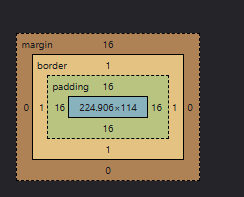

# CSS Foundations: Why We Need It, Selectors, Box Model & Cascade
## Part 1 of 4 — Overview & Core Mental Models

---

## 📌 Executive Summary: The Big Picture

HTML gives content **structure**. CSS gives it **appearance**. But CSS has its own hard parts that trip almost everyone up early on:

- **Why does one style "win" over another?** → Cascade & Specificity
- **How do I write CSS once and reuse it everywhere?** → Selectors, `:root`, `var()`
- **What is every element actually made of?** → The Box Model
- **How do I place an element exactly where I want it?** → Positioning

This doc — **Part 1 of 4** — covers the foundational mental models every other CSS topic builds on. The series:

| Part | Covers |
|---|---|
| **1. Foundations** (this doc) | Why CSS, selectors, box model, positioning, cascade, specificity, user agent styles, ways to write CSS |
| **2. Layout** | Flexbox, Grid, `:root`/`var()`, units (`px`/`em`/`rem`/`vh`/`vw`), responsiveness |
| **3. Advanced** | `display`/`visibility`/`opacity`, Atomic/utility CSS, pseudo-classes/elements, transitions/animations |
| **4. Cross-Browser** | Rendering engines, vendor prefixes, Autoprefixer, `@supports`, testing strategy |

---

## 🧠 Core Analogy: The Interior Designer

- **HTML** = the empty rooms and walls (structure — this room is a kitchen, that one's a bedroom).
- **CSS** = the interior designer — paint, furniture placement, lighting.
- **Cascade & Specificity** = the rulebook for "if two designers leave conflicting instructions for the same wall, whose instruction wins?"
- **The Box Model** = every single piece of furniture is itself a box made of the same four layers (content, padding, border, margin), no matter how simple or complex it looks.

---

## 🔤 Why CSS Selectors Are Needed

Without selectors, CSS would have no way to say **which** HTML elements a rule applies to. A selector is simply: **"find these elements, then apply this style to them."**

```css
selector {
  property: value;
}
```

```html
<p>This paragraph gets styled.</p>
```
```css
p {
  color: blue;
}
```

Every selector type below is just a different **strategy for finding elements** — some target by tag, some by a reusable label, some by a single unique element, some by relationship to other elements.

### Element Selector

Targets **every** instance of a tag:

```css
p {
  color: gray;
}
h1 {
  font-size: 2rem;
}
```

Use when a style should apply to *all* elements of that type, site-wide (e.g. all paragraphs get a base line-height).

### Class Selector

Targets any element carrying a specific `class` attribute — **reusable across many elements**:

```html
<p class="highlight">Important</p>
<span class="highlight">Also important</span>
```
```css
.highlight {
  background-color: yellow;
}
```

Classes are the **workhorse** of real-world CSS — reusable, combinable (`class="card highlight"`), and don't fight with element selectors.

### ID Selector

Targets exactly **one** element (IDs must be unique per page):

```html
<div id="main-header">...</div>
```
```css
#main-header {
  background-color: navy;
}
```

**Rarely used for styling in modern CSS** — IDs carry very high specificity (see below), making them hard to override later. IDs are still useful for `href="#section"` anchor links and JS `getElementById`, just avoid relying on them for styling.

### Group Selectors

Apply the same rule to multiple different selectors at once, comma-separated:

```css
h1, h2, h3 {
  font-family: 'Georgia', serif;
}

.btn-primary, .btn-secondary {
  padding: 10px 20px;
  border-radius: 4px;
}
```

Avoids repeating the same declaration block for every selector that needs it.

### Descendant Selectors

Targets an element **nested inside** another, regardless of depth:

```css
article p {
  line-height: 1.6;
}
```

This matches any `<p>` **anywhere inside** an `<article>` — one level deep or ten. Related combinators worth knowing:

```css
article > p     /* DIRECT child only, not deeper */
h2 + p          /* the paragraph immediately AFTER an h2 (adjacent sibling) */
h2 ~ p          /* ALL paragraph siblings after an h2 (general sibling) */
```

| Combinator | Symbol | Matches |
|---|---|---|
| Descendant | (space) | Any nested level |
| Child | `>` | Direct child only |
| Adjacent sibling | `+` | Immediately next sibling |
| General sibling | `~` | Any following sibling |

---

## 📦 The Box Model — What Every Element Actually Is

Before cascade, flexbox, or anything else, every single HTML element the browser renders is a **rectangular box** made of four nested layers. This is called the **CSS Box Model**, and misunderstanding it is the #1 cause of "why is this 20px too wide?" bugs.

```
┌─────────────────────────────────────────┐
│                 margin                    │  ← space OUTSIDE the box, between elements
│  ┌─────────────────────────────────────┐  │
│  │              border                   │  │  ← the box's visible edge/outline
│  │  ┌─────────────────────────────────┐  │  │
│  │  │            padding                │  │  │  ← space INSIDE the border, around content
│  │  │  ┌─────────────────────────────┐  │  │  │
│  │  │  │                                │  │  │  │
│  │  │  │           content              │  │  │  │  ← actual text/image/children
│  │  │  │                                │  │  │  │
│  │  │  └─────────────────────────────┘  │  │  │
│  │  └─────────────────────────────────┘  │  │
│  └─────────────────────────────────────┘  │
└─────────────────────────────────────────┘
```



```css
.box {
  width: 300px;
  padding: 20px;
  border: 5px solid black;
  margin: 10px;
}
```

| Layer | What it is | Does it have background color? |
|---|---|---|
| **Content** | The actual text/image/child elements | N/A — this is the content itself |
| **Padding** | Space between content and the border | Yes — takes the element's `background-color` |
| **Border** | A visible (or invisible) line around the padding | Has its own color/style |
| **Margin** | Space outside the border, between this box and neighboring elements | Always transparent — shows whatever is behind it |

### The `box-sizing` Trap

By default (`box-sizing: content-box`), `width`/`height` apply **only to the content** — padding and border get **added on top**, making the box bigger than the `width` you set:

```css
.box {
  box-sizing: content-box;  /* default */
  width: 300px;
  padding: 20px;
  border: 5px solid black;
}
/* Actual rendered width = 300 + 20+20 (padding) + 5+5 (border) = 350px, NOT 300px */
```

```css
.box {
  box-sizing: border-box;   /* the fix almost everyone wants */
  width: 300px;
  padding: 20px;
  border: 5px solid black;
}
/* Actual rendered width = 300px, exactly. Padding and border are now INCLUDED inside that 300px. */
```

**This is why nearly every project includes this at the very top of their CSS:**

```css
* {
  box-sizing: border-box;
}
```

It makes `width`/`height` behave the way most people intuitively expect — the number you set is the number you get, regardless of padding/border.

### Margin Collapse (A Common Surprise)

Vertical margins between **sibling block elements** don't add together — the **larger** one wins, the smaller one is absorbed:

```css
.a { margin-bottom: 20px; }
.b { margin-top: 30px; }
/* Gap between .a and .b is 30px, NOT 50px — this is "margin collapsing" */
```

This only happens with **vertical** margins on **block-level** elements in normal flow — it does not happen with `padding`, `flex`/`grid` gaps, or horizontal margins.

---

## 📍 CSS Positioning

The `position` property controls **how** an element is placed, and whether `top`/`right`/`bottom`/`left` do anything at all.

```css
.el {
  position: static;    /* default — normal document flow, top/left/etc. do NOTHING */
}
.el {
  position: relative;   /* stays in normal flow, but top/left/etc. shift it FROM where it would have been */
}
.el {
  position: absolute;   /* removed from normal flow, positioned relative to nearest positioned ANCESTOR */
}
.el {
  position: fixed;      /* removed from normal flow, positioned relative to the VIEWPORT — stays put on scroll */
}
.el {
  position: sticky;     /* normal flow, until a scroll threshold, then behaves like "fixed" within its parent */
}
```

| Value | Stays in normal flow? | Positioned relative to | Common use |
|---|---|---|---|
| `static` | Yes | N/A (default) | Nothing special — the baseline |
| `relative` | Yes (space still reserved) | Its own normal position | Small nudges, or to become an anchor for a child's `absolute` |
| `absolute` | **No** (space collapses) | Nearest ancestor with `position` set to anything but `static` | Dropdowns, tooltips, badges pinned to a corner of a card |
| `fixed` | **No** | The browser viewport (ignores scrolling) | Sticky headers/footers, floating chat buttons |
| `sticky` | Yes, until threshold | Its normal position, then the nearest scrolling ancestor | Section headers that stick while their section scrolls by |

### The "Positioning Context" Rule (Most Common `absolute` Bug)

`position: absolute` positions relative to the **nearest ancestor that itself has a `position` other than `static`** — not necessarily the direct parent, and not the whole page, unless nothing in between is positioned.

```css
.card {
  position: relative;   /* this becomes the "anchor" for any absolutely positioned children */
}
.badge {
  position: absolute;
  top: 8px;
  right: 8px;            /* positioned relative to .card's edges, not the page */
}
```

If `.card` didn't have `position: relative`, `.badge` would instead position itself relative to the next positioned ancestor up the tree — or the entire `<body>` if none exists. This "set `position: relative` on the parent just so an absolute child behaves" pattern is extremely common.

---

## ⚖️ Cascading vs. Override

**"Cascading"** is literally where **C**SS gets its name — **C**ascading **S**tyle **S**heets. It describes the algorithm the browser uses when **multiple rules target the same element with the same property**.

The cascade decides the winner using this order, top priority first:

1. **Importance** — `!important` rules beat everything (avoid relying on this).
2. **Specificity** — a more "specific" selector beats a less specific one (see below).
3. **Source order** — if specificity is *tied*, whichever rule appears **later** in the CSS wins.

```css
p { color: blue; }
p { color: red; }   /* This wins — same specificity, comes later */
```

```css
p { color: blue !important; }
p { color: red; }   /* Loses — !important always wins regardless of order */
```

**"Override" happens per-property, not per-rule.** The cascade doesn't replace an entire rule block with another — it merges declarations from every matching rule into one final set, deciding a winner independently for each property that's actually contested. A later rule only overrides the specific properties it re-declares; anything it doesn't mention is untouched and still comes from whichever earlier rule set it.

```css
p {
  color: blue;
  font-size: 16px;
  margin: 10px;
}

p {
  background-color: yellow;   /* only THIS property is contested */
}

/* Final result for every <p>: */
/* color: blue         ← from rule 1, never contested, so it survives untouched */
/* font-size: 16px     ← from rule 1, never contested, so it survives untouched */
/* margin: 10px         ← from rule 1, never contested, so it survives untouched */
/* background-color: yellow  ← the only property rule 2 actually declared */
```

If rule 2 had *also* declared `color: red;`, only `color` would flip to red — `font-size` and `margin` would still be untouched, because nothing challenged them. When people say "my CSS isn't overriding," they mean a *specific property* lost the cascade for that property — almost always a specificity or source-order issue on that one declaration, not the whole rule.

---

## 🧬 Specificity — How the Browser Picks a Winner

**Specificity is a scoring system.** Every selector gets a score; higher score wins, regardless of which stylesheet it's in or how "recent" it looks.

### The Specificity Scale (Low → High)

```
Element/tag selectors, pseudo-elements   →  weakest
Class, attribute, pseudo-class selectors →  medium
ID selectors                             →  strong
Inline style="..."                       →  stronger
!important                               →  strongest (breaks the cascade entirely)
```

### Specificity Calculation (the (a, b, c, d) system)

Think of specificity as a 4-part score, compared left to right:

| Category | Counts as | Example |
|---|---|---|
| **d = inline styles** | 1 if `style="..."` is used | `style="color:red"` |
| **c = IDs** | 1 per `#id` | `#header` |
| **b = classes, attributes, pseudo-classes** | 1 per `.class`, `[attr]`, `:hover` | `.btn`, `[type="text"]`, `:hover` |
| **a = elements, pseudo-elements** | 1 per tag, `::before` etc. | `div`, `p`, `::before` |

```css
p                      /* specificity: 0,0,0,1 */
.highlight              /* specificity: 0,0,1,0 */
#header                 /* specificity: 0,1,0,0 */
div.card.active         /* specificity: 0,0,2,1  (2 classes + 1 element) */
#header .nav a:hover    /* specificity: 0,1,2,1  (1 id + 2 classes/pseudo + 1 element) */
style="color:red"       /* specificity: 1,0,0,0  (always beats any selector in a stylesheet) */
```

**Comparison rule:** compare left-to-right, column by column. `0,1,0,0` (one ID) beats `0,0,99,99` (99 classes and 99 elements) — **one ID always beats any number of classes**, because you compare the ID column first and it already wins.

### Specificity: From CSS File to Inline — Full Priority Order

Putting it all together, here's the **complete order**, weakest to strongest, across every place a style can come from:

```
1. Browser default (user agent) styles         ← weakest, always loses to anything you write
2. Element/tag selectors                        (p, div, h1)
3. Class / attribute / pseudo-class selectors    (.btn, [type], :hover)
4. ID selectors                                  (#header)
5. Inline styles                                 (style="..." on the element)
6. !important                                    ← strongest, overrides all of the above
```

**Important nuance:** `!important` doesn't have infinite power — **two `!important` rules still fight using the normal specificity rules against each other.** It only jumps the whole rule above *non-*`!important` rules.

**Why `!important` is a code smell:** once you reach for it, you've admitted defeat against your own specificity — the next person has to reach for an even bigger hammer (`!important` + higher specificity) to override *you*. Prefer fixing the actual specificity/source-order issue instead.

---

## 🌐 What Is "User Agent Styles"?

**User agent = the browser itself** (Chrome, Firefox, Safari — literally the software "acting on the user's behalf" to render the page).

Every browser ships **default CSS rules** applied to every page before your own CSS runs — this is why an unstyled `<h1>` is already big and bold, and an unstyled `<button>` already looks like a button. These are called **User Agent styles** (or "browser default styles").

```css
/* Chrome's actual default user-agent stylesheet for h1: */
h1 {
  display: block;
  font-size: 2em;
  margin-block-start: 0.67em;
  margin-block-end: 0.67em;
  margin-inline-start: 0px;
  margin-inline-end: 0px;
  font-weight: bold;
  unicode-bidi: isolate;
}
```

Your own CSS — even a single `element.style { color: red; }` inline declaration — **overrides these by default**, because inline styles sit at the top of the specificity order and user-agent styles sit at the very bottom.

```
Chrome (User Agent) defaults  →  h1 { font-size: 2em; margin: ...; font-weight: bold; }
                                              ↓ overridden by ↓
element.style (inline)         →  { color: red; font-weight: 400; }
```

**This is exactly why CSS resets/normalizers exist** (`normalize.css`, or a manual reset block) — every browser's user-agent stylesheet is slightly different (different default margins on `<ul>`, different default `<button>` styling), so teams "zero out" these inconsistent defaults before applying their own design system:

```css
/* A common minimal reset */
* {
  margin: 0;
  padding: 0;
  box-sizing: border-box;
}
```

*(Resets/normalizers, and how they interact with different browser engines specifically, are covered in more depth in [Part 4 — Cross-Browser](4-CrossBrowser.md).)*

---

## 🧩 Ways to Write CSS: Inline, Internal, External

There are three places CSS can physically live, each with different tradeoffs.

```
CSS
 ├── Inline CSS    → put CSS directly inside the HTML tag via the style attribute
 ├── Internal CSS  → put CSS inside a <style> tag in the document's <head>
 └── External CSS  → put CSS in a separate .css file, linked via <link>
```

### Inline CSS

```html
<tagname style="prop: value; prop: value;">Click Me</tagname>

<button style="background-color: blue; color: white;">Click Me</button>
```

| | |
|---|---|
| **Benefit** | Simple, quick to read, tag and style are together in one place, easy to share a single snippet |
| **Downside** | Not reusable (must repeat on every element), gets ugly fast, highest specificity so it's hard to override later, mixes concerns (structure + style in one line) |

### Internal CSS

```html
<head>
  <style>
    h1 { color: navy; }
    p { line-height: 1.6; }
  </style>
</head>
```

Good for single-page demos or when styles are genuinely specific to one page. Doesn't scale across multiple pages — styles aren't shared.

### External CSS

```html
<head>
  <link rel="stylesheet" href="styles.css">
</head>
```
```css
/* styles.css */
h1 { color: navy; }
p { line-height: 1.6; }
```

| | |
|---|---|
| **Benefit** | Fully reusable across every page linking the file, separates structure (HTML) from presentation (CSS), browser can **cache** the file (see [CDN & Caching notes](../01-networking/03/3-CDN_Caching.md)) so repeat visits are faster |
| **Downside** | One extra network request (mitigated by caching), slight indirection — you have to open a second file to see the styles |

**Practical rule of thumb:** external CSS for real projects, internal for quick one-off demos, inline only for truly one-time overrides or values computed dynamically by JavaScript (`el.style.left = x + 'px'`).

---

## 💡 Cheat Sheet: Quick Reference

| Concept | One-line definition |
|---|---|
| **Cascade** | The algorithm deciding which conflicting rule wins: importance → specificity → source order |
| **Specificity** | A (inline, IDs, classes, elements) score — higher wins regardless of file/order |
| **User agent styles** | The browser's own built-in default CSS, weakest in the cascade |
| **Box model** | content → padding → border → margin, nested outward |
| **`box-sizing: border-box`** | Makes `width`/`height` include padding+border instead of adding to them |
| **Margin collapse** | Adjacent vertical margins merge into the larger one, not the sum |
| **`position: relative`** | Stays in flow, `top`/`left` shift it from its normal spot |
| **`position: absolute`** | Leaves flow, positions relative to nearest non-`static` ancestor |
| **`position: fixed`** | Leaves flow, positions relative to the viewport, ignores scroll |
| **`position: sticky`** | Normal flow until a scroll threshold, then behaves like `fixed` |

### Selector Priority, One Line

```
element (1) < class/attr/pseudo-class (10) < ID (100) < inline (1000) < !important (always wins)
```

---

## 🎯 Key Takeaways

1. **The cascade resolves conflicts in a fixed order: `!important` → specificity → source order** — "my CSS isn't working" is almost always one of these three, most often specificity.
2. **Specificity is a hard math comparison, not a feeling** — one ID beats any number of classes; inline styles beat any selector in a stylesheet; `!important` beats everything except a stronger `!important`.
3. **Every browser ships default "user agent" styles** — this is why unstyled HTML still looks like *something*, and why CSS resets exist (to neutralize inconsistent defaults across browsers).
4. **`box-sizing: border-box` should be a default on every project** — without it, `width` silently excludes padding/border, causing constant off-by-a-few-pixels layout bugs.
5. **`position: absolute` positions relative to the nearest *positioned* ancestor, not the page** — if nothing in between has `position: relative/absolute/fixed/sticky`, it escapes all the way up to `<body>`, which is rarely what's intended.
6. **Override happens per-property, not per-rule** — a later rule only replaces the specific declarations it re-states; everything else it doesn't mention still comes from earlier, uncontested rules.

---

## 📚 Continue the Series

- **Next → [Part 2: Layout](2-Layout.md)** — Flexbox, Grid, `:root`/`var()`, units, responsiveness
- **[Part 3: Advanced](3-Advanced.md)** — display/visibility/opacity, Atomic CSS, pseudo-classes, transitions
- **[Part 4: Cross-Browser](4-CrossBrowser.md)** — rendering engines, vendor prefixes, testing

---

## 🔗 Resources

- **MDN CSS Reference:** https://developer.mozilla.org/en-US/docs/Web/CSS
- **MDN Specificity Calculator context:** https://developer.mozilla.org/en-US/docs/Web/CSS/Specificity

---

**Last updated:** 2026-08-19
**Author:** Mohammed Saif
**LinkedIn:** linkedin.com/in/mohammedsaif001/
**Series:** Part 1 of 4 — CSS Deep Dive (Foundations)
