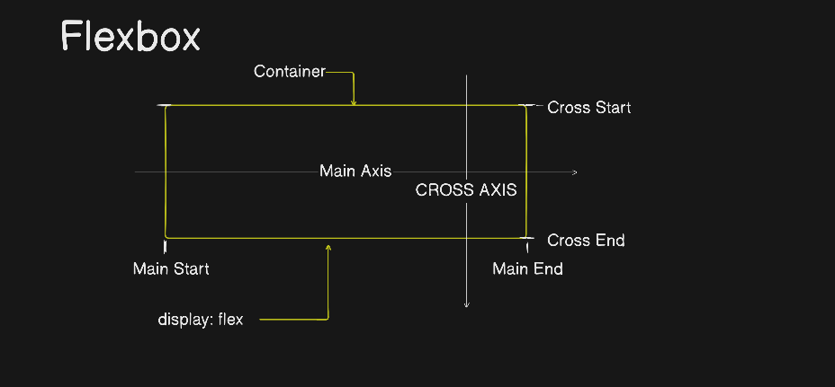

# CSS Layout: Flexbox, Grid, Variables, Units & Responsiveness
## Part 2 of 4 — Building Layouts That Adapt

---

## 📌 Executive Summary

Once the foundations (cascade, box model, positioning — see [Part 1](1-Foundations.md)) are solid, the next question is: **how do I actually arrange elements on the page, and make that arrangement work on every screen size?**

This doc covers:

- **Flexbox** — one-axis layout (rows or columns)
- **Grid** — two-axis layout (rows *and* columns together)
- **`:root` + `var()`** — CSS's built-in reusable variables
- **Units** (`px`, `em`, `rem`, `vh`, `vw`) — what each is relative to, and when to use which
- **Responsiveness** — media queries, mobile-first design, fluid layout

---

## 📐 Flexbox — One-Dimensional Layout

**Flexbox (Flexible Box Layout)** arranges items along a **single axis** — either a row or a column — and excels at distributing space and alignment along that axis.

### Turning It On

```css
.container {
  display: flex;
}
```

The moment `display: flex` is applied, **every direct child becomes a flex item**, automatically arranged in a row by default.

### The Two Axes

This is the single most important mental model in Flexbox — **everything is described relative to two axes**:

```
                     Container
        ┌──────────────────────────────────┐
        │                                    │
Main    │→ → → → → → → → → → → → → → → → →  │  ← Main Axis
Start   │                                    │  Main End
        │                                    │
        └──────────────────────────────────┘
                        ↑
                   Cross Axis
              (Cross Start → Cross End)
```

| Term | Meaning |
|---|---|
| **Main Axis** | The primary direction items flow along — horizontal by default (`flex-direction: row`) |
| **Cross Axis** | Perpendicular to the main axis — vertical by default |
| **Main Start / Main End** | The beginning/end edge along the main axis |
| **Cross Start / Cross End** | The beginning/end edge along the cross axis |
| **Container** | The parent element with `display: flex` |

**The critical twist:** if you set `flex-direction: column`, the main axis **rotates to vertical**, and the cross axis becomes horizontal. Every property below (`justify-content`, `align-items`) still refers to "main axis" and "cross axis" — so their visual direction flips along with `flex-direction`.


### Core Flex Container Properties

```css
.container {
  display: flex;
  flex-direction: row;        /* row | row-reverse | column | column-reverse */
  justify-content: flex-start; /* aligns items along the MAIN axis */
  align-items: stretch;        /* aligns items along the CROSS axis */
  flex-wrap: nowrap;           /* nowrap | wrap | wrap-reverse */
  align-content: stretch;      /* aligns WRAPPED ROWS along the cross axis (only matters with wrap) */
  gap: 16px;                   /* space between items, both axes */
}
```

| Property | Controls | Common values |
|---|---|---|
| `flex-direction` | Which way the main axis runs | `row` (default), `row-reverse`, `column`, `column-reverse` |
| `justify-content` | Spacing/alignment along the **main axis** | `flex-start`, `center`, `flex-end`, `space-between`, `space-around`, `space-evenly` |
| `align-items` | Alignment along the **cross axis** (single line) | `stretch` (default), `flex-start`, `center`, `flex-end`, `baseline` |
| `flex-wrap` | Whether items wrap to a new line when they don't fit | `nowrap` (default), `wrap`, `wrap-reverse` |
| `align-content` | Alignment of **multiple wrapped rows** along the cross axis | Same values as `justify-content` — only visible effect when `flex-wrap: wrap` and there's extra space |
| `gap` | Space between items (replaces old margin hacks) | Any length, e.g. `16px`, `1rem` |

### Core Flex Item Properties

Applied to the **children**, not the container:

```css
.item {
  flex-grow: 0;     /* how much this item grows to fill extra space, relative to siblings */
  flex-shrink: 1;    /* how much this item shrinks when space is tight */
  flex-basis: auto;  /* the item's starting size before growing/shrinking */
  align-self: auto;  /* override align-items for THIS one item */
}

/* Shorthand for grow/shrink/basis: */
.item {
  flex: 1 1 auto;    /* flex: <grow> <shrink> <basis> */
}
```

**The famous `flex: 1` shorthand:** `flex: 1` means "grow to fill available space equally with sibling items that also have `flex: 1`" — the single most common Flexbox pattern for equal-width columns.

### Full Runnable Example

```html
<div class="container">
  <div class="item">1</div>
  <div class="item">2</div>
  <div class="item">3</div>
</div>
```
```css
.container {
  display: flex;
  justify-content: space-between;
  align-items: center;
  gap: 10px;
  height: 200px;
  border: 1px solid #333;
}
.item {
  flex: 1;
  background: teal;
  color: white;
  padding: 20px;
  text-align: center;
}
```

---

## 🔲 CSS Grid — Two-Dimensional Layout

Where Flexbox handles **one axis** well, **Grid** is built for laying things out in **rows AND columns simultaneously** — true 2D layout.

### Turning It On

```css
.container {
  display: grid;
}
```

### Defining Rows & Columns

```css
.container {
  display: grid;
  grid-template-columns: 200px 1fr 1fr;  /* 3 columns: fixed, then two flexible */
  grid-template-rows: 100px auto;         /* 2 rows: fixed height, then auto */
  gap: 16px;
}
```

**`fr` unit** = "fraction of available space" — Grid's own flexible unit, similar in spirit to `flex-grow`. `1fr 1fr` splits remaining space into two equal parts; `1fr 2fr` gives the second column double the first's share.

**Shorthand with `repeat()`** — avoids writing `1fr` many times:

```css
grid-template-columns: repeat(3, 1fr);        /* same as: 1fr 1fr 1fr */
grid-template-columns: repeat(4, minmax(150px, 1fr)); /* responsive-friendly */
```

### Grid Template Rows

```css
.container {
  display: grid;
  grid-template-rows: 80px 1fr 60px;  /* header, flexible content, footer */
}
```

This explicitly sizes each row: a fixed 80px header row, a flexible middle row that consumes remaining space, and a fixed 60px footer row.

### Placing Items — `grid-column` / `grid-row` (Grid Start/End)

Every grid line has a number, starting at `1`. You place items by telling them which lines to **start** and **end** at:

```
     col-line 1   col-line 2   col-line 3   col-line 4
          ┌───────────┬────────────┬───────────┐
row-line 1│           │            │           │
          ├───────────┼────────────┼───────────┤
row-line 2│           │            │           │
          ├───────────┼────────────┼───────────┤
row-line 3│           │            │           │
          └───────────┴────────────┴───────────┘
```

```css
.item {
  grid-column-start: 1;
  grid-column-end: 3;     /* spans from column line 1 to line 3 (covers 2 columns) */
  grid-row-start: 1;
  grid-row-end: 2;
}

/* Shorthand versions: */
.item {
  grid-column: 1 / 3;     /* start / end */
  grid-row: 1 / 2;
}

/* "span" keyword — relative sizing instead of exact line numbers: */
.item {
  grid-column: span 2;    /* span 2 columns from wherever it naturally lands */
}
```

### Grid Template Areas — Naming Layout Regions

**`grid-template-areas`** lets you draw the layout **as ASCII art directly in your CSS** — genuinely one of CSS's most readable features:

```css
.container {
  display: grid;
  grid-template-columns: 200px 1fr;
  grid-template-rows: 80px 1fr 60px;
  grid-template-areas:
    "sidebar header"
    "sidebar main"
    "sidebar footer";
}

.header { grid-area: header; }
.sidebar { grid-area: sidebar; }
.main    { grid-area: main; }
.footer  { grid-area: footer; }
```

```html
<div class="container">
  <div class="header">Header</div>
  <div class="sidebar">Sidebar</div>
  <div class="main">Main Content</div>
  <div class="footer">Footer</div>
</div>
```

Each **string** in `grid-template-areas` is one row; each **word** in the string is one column's area name. Repeating a name across cells (like `sidebar` spanning 3 rows above) makes that item **span** those cells automatically. This single block *is* the visual layout — you can literally see the page shape in the CSS.

### Flexbox vs. Grid — When to Use Which

| | Flexbox | Grid |
|---|---|---|
| **Dimension** | One axis at a time (row OR column) | Two axes at once (rows AND columns) |
| **Best for** | Navbars, button groups, centering one thing, distributing items along a line | Whole page layouts, card grids, anything needing explicit rows+columns |
| **Content-driven or layout-driven?** | Content-driven — items size based on their content | Layout-driven — you define the grid first, then place content into it |
| **Can combine?** | Yes — Grid for the page skeleton, Flexbox inside individual grid cells for row alignment | Same |

---

## 🎯 `:root {}` and CSS Custom Properties (`var()`)

### What Is `:root`?

`:root` is a **pseudo-class selector** that targets the highest-level ancestor in the document — for HTML documents, this is effectively the same as `<html>`, but with **higher specificity** than the `html` element selector.

```css
:root {
  --primary-color: #3b82f6;
  --spacing-unit: 8px;
}
```

`:root` is the conventional place to declare **CSS custom properties** (commonly called **CSS variables**) because it makes them available **globally**, to every element in the document.

### What Is `var()`?

`var()` **reads** a custom property's value:

```css
:root {
  --primary-color: #3b82f6;
  --spacing-unit: 8px;
}

.button {
  background-color: var(--primary-color);
  padding: var(--spacing-unit) calc(var(--spacing-unit) * 2);
}
```

**Why this matters — the core benefit:** change `--primary-color` in **one place** (`:root`), and every single rule using `var(--primary-color)` updates automatically. This is CSS's built-in answer to "define once, use everywhere" — the same idea as a constant in a programming language.

**`var()` with a fallback value** — used if the custom property isn't defined:

```css
.button {
  color: var(--text-color, black); /* uses black if --text-color isn't set anywhere */
}
```

### Custom Properties Can Be Scoped, Not Just Global

```css
:root {
  --gap: 16px;      /* global default */
}

.compact-section {
  --gap: 4px;        /* overridden just within this section */
}

.card {
  padding: var(--gap); /* picks up whichever --gap is closest in the cascade */
}
```

This is genuinely powerful — a `.card` inside `.compact-section` automatically gets the tighter `--gap`, with zero extra selectors, because custom properties **cascade and inherit** like any other CSS value (see [cascade fundamentals in Part 1](1-Foundations.md#️-cascading-vs-override)).

### Why This Matters for Theming (Dark Mode Example)

```css
:root {
  --bg-color: white;
  --text-color: black;
}

[data-theme="dark"] {
  --bg-color: #1a1a1a;
  --text-color: white;
}

body {
  background-color: var(--bg-color);
  color: var(--text-color);
}
```

Flipping a single `data-theme` attribute on `<html>` re-themes the entire site — no need to duplicate every color rule for light/dark.

---

## 📏 Units: `rem`, `em`, `px`, `vh`, `vw` — What's the Difference

| Unit | Type | Relative to |
|---|---|---|
| **`px`** | Absolute | Fixed — 1px is always 1px, regardless of context |
| **`em`** | Relative | The **font-size of the current element's parent** (or itself, for non-font properties) — compounds when nested |
| **`rem`** | Relative | The font-size of the **root** (`<html>`) element only — does **not** compound |
| **`vh`** | Relative | **1% of the viewport height** (the visible browser window) |
| **`vw`** | Relative | **1% of the viewport width** |

### `px` — Pixels (Absolute)

```css
.box {
  width: 300px;
  font-size: 16px;
}
```

Predictable, but **doesn't scale** if a user changes their browser's default font size (an accessibility feature many users rely on) — `px` font-sizes ignore that setting.

### `em` — Relative to Parent (and Compounds!)

```css
.parent {
  font-size: 20px;
}
.child {
  font-size: 1.5em;   /* 1.5 × 20px = 30px */
}
.grandchild {
  font-size: 1.5em;   /* 1.5 × 30px = 45px  ← compounds! */
}
```

**The classic `em` trap:** because `em` is relative to the *parent's computed font-size*, nesting elements with `em`-based font-sizes **compounds** — sizes balloon unexpectedly as nesting gets deeper. This is the single biggest reason `rem` became the preferred default.

`em` is still genuinely useful for properties that should scale *with the element's own font-size* — e.g. `padding: 0.5em` on a button scales its padding proportionally if the button's font-size changes.

### `rem` — Relative to Root Only (No Compounding)

```css
html {
  font-size: 16px;   /* the root/default */
}
.child {
  font-size: 1.5rem;  /* 1.5 × 16px = 24px, ALWAYS, no matter how deeply nested */
}
.grandchild {
  font-size: 1.5rem;  /* still 24px — rem never compounds */
}
```

**Why `rem` is the modern default for font-size/spacing:** predictable at any nesting depth, and — critically — **it respects the user's browser font-size setting**, since it's still relative to `html`'s font-size (which browsers let users change for accessibility), unlike raw `px`.

### `vh` / `vw` — Relative to the Viewport

```css
.hero {
  height: 100vh;   /* exactly the full visible browser window height */
  width: 100vw;    /* exactly the full visible browser window width */
}

.sidebar {
  width: 25vw;      /* always 25% of the current window width, resizes live */
}
```

Common use: full-screen hero sections (`height: 100vh`), or font sizes that scale with the viewport for fluid typography (`font-size: 4vw`).

**Known gotcha:** on mobile browsers, `100vh` can be taller than the *actually visible* area because mobile browser UI (address bar) shows/hides dynamically as the user scrolls — this is why `dvh`/`dvw` (dynamic viewport units, newer) exist as a fix. This is also covered as a cross-browser trouble spot in [Part 4](4-CrossBrowser.md).

### `dvh` / `dvw` — Dynamic Viewport Units, and How They Differ from `vh`/`vw`

**The problem `dvh`/`dvw` solve:** on mobile, the browser chrome (address bar, bottom toolbar) isn't fixed — it slides away as you scroll down and reappears when you scroll up. `vh`/`vw` were originally defined against the **largest possible viewport** (chrome collapsed), so `height: 100vh` often renders **taller than what's actually visible** the moment the address bar is showing — a footer or a "full screen" hero section ends up partially cut off behind the browser UI.

```css
.hero {
  height: 100vh;    /* sized against the viewport with browser UI COLLAPSED — can overflow when UI is visible */
  height: 100dvh;   /* "dynamic viewport height" — always matches whatever is ACTUALLY visible right now */
}
```

`dvh`/`dvw` **continuously recalculate** as the browser chrome shows/hides, so `100dvh` always equals the truly visible height at any given moment — including live updates as the user scrolls and the address bar animates away.

There are actually **three** viewport-height flavors, not just two:

| Unit | Measures against | Behavior as browser UI shows/hides |
|---|---|---|
| **`vh`** (and `vw`) | A single fixed snapshot — historically the *largest* viewport (UI collapsed) in most mobile browsers | Static — does **not** update; can overflow past the visible area when UI is showing |
| **`svh`** (and `svw`) | "Small viewport height" — the *smallest* possible viewport (browser UI fully visible/expanded) | Static — guarantees content fits even in the most cramped state, but wastes space once UI collapses |
| **`lvh`** (and `lvw`) | "Large viewport height" — the *largest* possible viewport (browser UI fully collapsed) | Static — same idea as legacy `vh`, just standardized/explicit |
| **`dvh`** (and `dvw`) | "Dynamic viewport height" — **live**, tracks the browser UI's current state | **Dynamic** — recalculates continuously as the address bar shows/hides |

**The practical difference, side by side:**

```css
.hero-old   { height: 100vh; }   /* may be taller than what's visible when the address bar is up */
.hero-fixed { height: 100dvh; }  /* always exactly matches the currently visible viewport */
.hero-safe  { height: 100svh; }  /* guaranteed to fit even in the worst case, but leaves a gap once UI collapses */
```

**Why `dvh` isn't a blind universal replacement for `vh`:** because it recalculates live, using `dvh` for something like a full-page background can cause the layout to **visibly resize/jump** while the user is actively scrolling and the browser chrome animates in/out — sometimes a stable `svh` (small viewport, worst-case-safe) is actually the better, jitter-free choice for a background or fixed frame, while `dvh` is better for content that genuinely should hug the true visible edge (a bottom action bar, a full-bleed hero on first load).

**Practical pattern — fallback for older browsers that don't support `dvh` yet:**

```css
.hero {
  height: 100vh;    /* fallback for browsers without dvh support */
  height: 100dvh;   /* modern browsers override with the accurate value */
}
```

Since `dvh`/`dvw` are newer, always check current support on [Can I Use](https://caniuse.com/?search=dvh) before relying on them without a fallback — see the [Cross-Browser doc](4-CrossBrowser.md) for the general workflow (Can I Use → `@supports` → fallback).

### Quick Decision Guide

| Use case | Recommended unit |
|---|---|
| Font sizes | `rem` |
| Spacing/padding/margin relative to font-size of the element itself | `em` |
| Fixed, never-scaling dimensions (borders, precise icons) | `px` |
| Full-screen sections, viewport-relative sizing | `vh` / `vw` |
| Fluid/responsive component sizing (percentages of parent) | `%` |

---

## 📱 Responsiveness — Making a Site Work on Every Screen

**Responsive design** means a layout adapts to different screen sizes rather than breaking or requiring horizontal scrolling.

### 1. The Viewport Meta Tag (Required First Step)

```html
<meta name="viewport" content="width=device-width, initial-scale=1.0">
```

Without this, mobile browsers **fake a desktop-width viewport** (usually 980px) and zoom out — this single line tells the browser to use the device's actual width. Every responsive site needs this in `<head>`.

### 2. Media Queries — Conditional CSS Based on Screen Size

```css
/* Default: mobile styles (mobile-first approach) */
.container {
  flex-direction: column;
}

/* Applies ONLY when viewport is 768px or wider */
@media (min-width: 768px) {
  .container {
    flex-direction: row;
  }
}

/* Applies ONLY when viewport is 1200px or wider */
@media (min-width: 1200px) {
  .container {
    max-width: 1140px;
    margin: 0 auto;
  }
}
```

**Mobile-first vs. desktop-first:**

```css
/* Mobile-first (recommended): base styles = mobile, then min-width adds complexity for bigger screens */
.box { width: 100%; }
@media (min-width: 768px) { .box { width: 50%; } }

/* Desktop-first: base styles = desktop, then max-width strips down for smaller screens */
.box { width: 50%; }
@media (max-width: 767px) { .box { width: 100%; } }
```

Mobile-first is generally preferred — it forces you to design the constrained case first, then progressively enhance, rather than trying to cram a desktop layout into a phone as an afterthought. (This same "start with the working baseline" philosophy shows up again as **progressive enhancement** in [Part 4](4-CrossBrowser.md).)

### 3. Fluid Units Instead of Fixed Ones

```css
/* Rigid — breaks on small screens */
.card { width: 400px; }

/* Fluid — adapts naturally */
.card { width: 100%; max-width: 400px; }
```

### 4. Flexbox/Grid `wrap` and `auto-fit` — Layout That Adapts Without Media Queries

```css
.gallery {
  display: grid;
  grid-template-columns: repeat(auto-fit, minmax(200px, 1fr));
  gap: 16px;
}
```

This single line creates a **responsive grid with zero media queries**: as many 200px+ columns as fit the current width, each stretching equally (`1fr`) to fill leftover space, automatically re-flowing as the window resizes.

### 5. Responsive Images

```html

```

`max-width: 100%` prevents an image from ever overflowing its container, while `height: auto` keeps its aspect ratio intact as width shrinks.

### Common Breakpoints (Convention, Not a Spec Rule)

| Breakpoint | Typical target |
|---|---|
| `< 576px` | Small phones |
| `576px – 768px` | Large phones / small tablets |
| `768px – 1024px` | Tablets |
| `1024px – 1440px` | Laptops/small desktops |
| `> 1440px` | Large desktops |

---

## 💡 Cheat Sheet: Quick Reference

| Concept | One-line definition |
|---|---|
| **Flexbox** | One-axis layout system — main axis + cross axis |
| **Grid** | Two-axis (row + column) layout system |
| **`fr`** | Grid's flexible fraction unit — like `flex-grow` for grid tracks |
| **`grid-template-areas`** | Named layout regions drawn as ASCII art in CSS |
| **`:root`** | Pseudo-class targeting the document root — conventional home for CSS custom properties |
| **`var(--x)`** | Reads a CSS custom property's value; supports a fallback: `var(--x, default)` |
| **`rem`** | Relative to root `<html>` font-size — never compounds |
| **`em`** | Relative to parent's font-size — compounds when nested |
| **`vh` / `vw`** | 1% of viewport height / width — static, snapshot against the largest viewport state |
| **`dvh` / `dvw`** | "Dynamic" viewport height/width — live, recalculates as mobile browser UI shows/hides |
| **`svh` / `lvh`** | "Small"/"large" viewport height — static worst-case (UI shown) / best-case (UI hidden) snapshots |
| **Mobile-first** | Base styles for small screens, `min-width` media queries add complexity upward |

### Units, One Line

```
px = fixed  |  % = relative to parent  |  em = relative to own font-size (compounds)
rem = relative to root font-size (never compounds)  |  vh/vw = relative to viewport (static)
dvh/dvw = relative to the CURRENTLY visible viewport (updates live as mobile browser UI shows/hides)
```

---

## 🎯 Key Takeaways

1. **Flexbox = one axis, Grid = two axes** — reach for Flexbox for a single row/column of items, Grid when you need explicit rows *and* columns together.
2. **`:root` + `var()` is CSS's built-in "define once, use everywhere"** — and because custom properties cascade, they can be selectively overridden in specific sections (great for theming/dark mode).
3. **`rem` beats `em` for font-sizing in most cases** because `em` compounds with nesting depth while `rem` always stays relative to the root — but `em` is still right for spacing that should scale with a specific element's own font-size.
4. **Responsiveness starts with the viewport meta tag** — nothing else works correctly on mobile without it.
5. **`grid-template-areas` makes layout structure visually readable in the CSS itself** — you can see the page skeleton by reading the ASCII-art string.
6. **Modern Grid (`auto-fit` + `minmax`) can build fully responsive layouts with zero media queries** — a huge simplification over the old fixed-breakpoint approach.
7. **`vh`/`vw` are a static snapshot; `dvh`/`dvw` are live** — `100vh` on mobile can overflow past what's actually visible when the address bar is showing, while `100dvh` always tracks the true visible area, recalculating as the browser UI animates in and out.

---

## 📚 Continue the Series

- **← Previous: [Part 1: Foundations](1-Foundations.md)** — cascade, specificity, box model, positioning
- **Next → [Part 3: Advanced](3-Advanced.md)** — display/visibility/opacity, Atomic CSS, pseudo-classes, transitions
- **[Part 4: Cross-Browser](4-CrossBrowser.md)** — rendering engines, vendor prefixes, testing

---

## 🔗 Resources

- **CSS-Tricks — A Complete Guide to Flexbox:** https://css-tricks.com/snippets/css/a-guide-to-flexbox/
- **CSS-Tricks — A Complete Guide to Grid:** https://css-tricks.com/snippets/css/complete-guide-grid/
- **Play with Flexbox interactively:** https://flexboxfroggy.com/
- **Play with Grid interactively:** https://cssgridgarden.com/

---

**Last updated:** 2026-08-19
**Author:** Mohammed Saif
**LinkedIn:** linkedin.com/in/mohammedsaif001/
**Series:** Part 2 of 4 — CSS Deep Dive (Layout)
