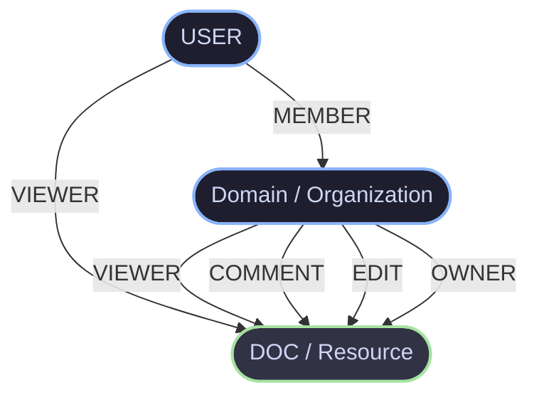
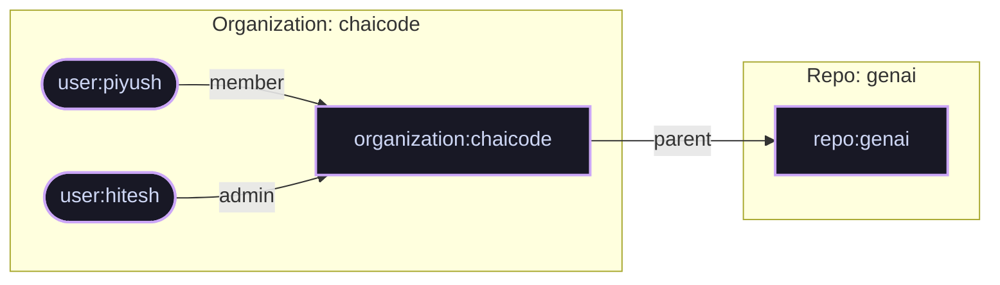

# Authorization Architecture — RBAC, Multi-Tenant ReBAC, Google Zanzibar, OpenFGA & ABAC

---

## 1. Authentication vs. Authorization — The Fundamental Split

In application security, systems are divided into two distinct responsibilities: **Authentication (AuthN)** and **Authorization (AuthZ)**.

```
+-------------------------------------------------------------------------------+
|                               SECURITY SYSTEM                                 |
+---------------------------------------+---------------------------------------+
|        AUTHENTICATION (AuthN)         |          AUTHORIZATION (AuthZ)        |
+---------------------------------------+---------------------------------------+
|  Question: "Who are you?"             |  Question: "What can you do?"         |
|  Goal: Verify user identity           |  Goal: Enforce permissions & access   |
|  Mechanism: Passwords, OTP, JWTs,     |  Mechanism: RBAC, ReBAC, ABAC,        |
|             OAuth2, OIDC, Passkeys    |             Scopes, ACLs, Zanzibar    |
|  Output: Validated Identity (User ID) |  Output: Boolean decision (Allow/Deny)|
+---------------------------------------+---------------------------------------+
```

1. **Authentication (AuthN)**: Verifies that the entity making the request is genuinely who they claim to be. It answers *"Are you the real user?"* via credentials, signed JWT tokens, or identity providers (OIDC).
2. **Authorization (AuthZ)**: Happens **after** authentication. Once identity is confirmed, authorization checks what privileges or permissions that specific user holds regarding a requested resource. It answers *"Does user X have permission to create, read, update, or delete resource Y?"*

---

## 2. Role-Based Access Control (RBAC)

**Role-Based Access Control (RBAC)** is the most common authorization model. Instead of assigning permissions directly to individual users, permissions are grouped into **Roles** (e.g., `ADMIN`, `MANAGER`, `USER`, `GUEST`), and users are assigned one or more roles.

```
[ User ] ---> belongs to ---> [ Role ] ---> grants ---> [ Permissions (Read/Write/Delete) ]
```

---

### 2.1 Storing Roles: String vs. Pyramid Numerical Weight Strategy ("Breathing Space")

#### Naive Approach: String Roles
Storing roles as simple strings like `"ADMIN"`, `"USER"`, `"GUEST"` in the database:

```typescript
// Naive string checking
if (user.role === "ADMIN" || user.role === "MANAGER") {
  // allow write operation
}
```

**Disadvantage of string matching:**
- Checks become verbose and repetitive as roles scale.
- Does not naturally reflect role **hierarchy** (that an Admin inherently has all privileges of a Manager and User).

---

#### Numeric Role Weights & The Pyramid Hierarchy
In real-world organizations, roles form a pyramid hierarchy:

```
               / \
              /   \        ADMIN  (Weight: 0)
             /     \
            /       \      MANAGER (Weight: 30)
           /         \
          /           \    USER    (Weight: 70)
         /             \
        /---------------\  GUEST   (Weight: 100)
```

By assigning numeric weight levels to roles where lower values represent higher privileges:

```typescript
enum RoleWeight {
  ADMIN = 0,
  MANAGER = 30,
  USER = 70,
  GUEST = 100,
}
```

Permission checks simplify to clean threshold inequalities:

```typescript
// Any role up to GUEST can perform read operations
const canRead = user.roleWeight <= RoleWeight.GUEST; // <= 100

// Only MANAGER level or higher (ADMIN) can create resources
const canCreate = user.roleWeight <= RoleWeight.MANAGER; // <= 30

// Only ADMIN level can delete system resources
const canDelete = user.roleWeight <= RoleWeight.ADMIN; // <= 0
```

---

#### The Need for "Breathing Space" (Numerical Spacing)

> **Key Rule:** Never allocate sequential integers (`0, 1, 2, 3`) for role levels!

If you allocate roles sequentially:
- `ADMIN = 0`
- `MANAGER = 1`
- `USER = 2`
- `GUEST = 3`

If business requirements later require introducing a `SUB_ADMIN` (between `ADMIN` and `MANAGER`), or a `TEAM_LEAD` (between `MANAGER` and `USER`), you cannot insert them without re-indexing all numbers and modifying existing threshold code across the codebase.

**The Solution — Breathing Space:**
Leave numerical gaps between role weights:
- `ADMIN = 0`
- `MANAGER = 30`
- `USER = 70`
- `GUEST = 100`

Now, if a `SUB_ADMIN` is required, it can be assigned `15` (`0 < 15 < 30`). Existing threshold logic (`user.roleWeight <= 30`) automatically evaluates `SUB_ADMIN` correctly without code modifications!

---

#### Technical Nuance & Correction: Limit of Pure Numeric Weights
While numeric ranges work for strict linear hierarchies, **pure numeric weights fail when roles have orthogonal (non-overlapping) permissions**.

For example:
- `FINANCE_ADMIN`: Can refund payments, cannot touch source code repositories.
- `DEVOPS_LEAD`: Can deploy source code, cannot touch refund payments.

Neither role is strictly "higher" or "lower" than the other. When permissions branch orthogonally, flat numeric ordering must be combined with explicit **Permission Sets** or **Normalized DB Schemas**.

---

### 2.2 Database Normalization for RBAC

Storing `role` as a single column inside the `users` table works for basic applications, but violates database normalization principles when roles have dynamic permissions. A fully normalized RBAC schema uses junction tables:

```
+---------------+       +------------------+       +---------------+
|     users     |       |    user_roles    |       |     roles     |
+---------------+       +------------------+       +---------------+
| id (PK)       | <---- | user_id (FK)     | ----> | id (PK)       |
| name          |       | role_id (FK)     |       | name          |
| email         |       +------------------+       | weight        |
+---------------+                                  +---------------+
                                                           ^
                                                           |
                                                +--------------------+
                                                |  role_permissions  |
                                                +--------------------+
                                                | role_id (FK)       |
                                                | permission_id (FK) |
                                                +--------------------+
                                                           |
                                                           v
                                                   +---------------+
                                                   |  permissions  |
                                                   +---------------+
                                                   | id (PK)       |
                                                   | action_key    |
                                                   +---------------+
```

---

## 3. The Multi-Tenant Problem — Why Global RBAC Breaks

### Single-Tenant vs. Multi-Tenant Authorization

- **Single-Tenant Application**: A user has one global identity and one global role. E.g., John is an `ADMIN` of the entire web application.
- **Multi-Tenant Application**: The platform hosts multiple organizations/tenants (e.g., GitHub, Slack, Notion, AWS). A single user can belong to multiple organizations with **different roles in each context**.

> **Example:** User `piyush@example.com` is an **`ADMIN`** in Organization `Chaicode`, but is only a **`MEMBER`** or **`GUEST`** in Organization `AcmeCorp`.

If `role` is stored directly on the `users` table (`users.role`), the user has the same role everywhere, making multi-tenancy impossible.

---

### Multi-Tenant Database Architecture (4 Core Tables)

To support multi-tenancy, authorization must be scoped to organizations and sub-resources using junction mapping tables:

```sql
-- 1. Core User Table
CREATE TABLE users (
    id VARCHAR(36) PRIMARY KEY,
    name VARCHAR(255) NOT NULL,
    email VARCHAR(255) UNIQUE NOT NULL
);

-- 2. Organization Table (Tenants)
CREATE TABLE organizations (
    id VARCHAR(36) PRIMARY KEY,
    name VARCHAR(255) NOT NULL,
    domain VARCHAR(255) UNIQUE NOT NULL
);

-- 3. Resource Table (e.g., Repositories owned by an Org)
CREATE TABLE repositories (
    id VARCHAR(36) PRIMARY KEY,
    org_id VARCHAR(36) REFERENCES organizations(id) ON DELETE CASCADE,
    name VARCHAR(255) NOT NULL
);

-- 4. User-Organization Role Mapping (Org-Level Scope)
CREATE TABLE user_org_roles (
    user_id VARCHAR(36) REFERENCES users(id) ON DELETE CASCADE,
    org_id VARCHAR(36) REFERENCES organizations(id) ON DELETE CASCADE,
    role VARCHAR(50) NOT NULL, -- 'ADMIN', 'MEMBER', 'GUEST'
    PRIMARY KEY (user_id, org_id)
);

-- 5. User-Repository Role Mapping (Resource-Level Scope / Overrides)
CREATE TABLE user_repo_roles (
    user_id VARCHAR(36) REFERENCES users(id) ON DELETE CASCADE,
    repo_id VARCHAR(36) REFERENCES repositories(id) ON DELETE CASCADE,
    role VARCHAR(50) NOT NULL, -- 'ADMIN', 'MAINTAINER', 'CONTRIBUTOR', 'VIEWER'
    PRIMARY KEY (user_id, repo_id)
);
```

---

### Org-Level vs. Repo-Level Permission Inheritance

In a system with 50 repositories under an Organization:

1. **Granular Repo Access**: If onboarding an external contractor who should only access 1 repository, create a entry in `user_repo_roles` for that specific `repo_id`.
2. **Cascading Org Access**: Instead of populating 50 separate rows in `user_repo_roles` for an admin, grant `ADMIN` at the `user_org_roles` level. The authorization system automatically cascades org-level privileges to all repositories owned by that organization.

```
                  +-------------------------+
                  | Organization: Chaicode  |
                  +-------------------------+
                               |
            +------------------+------------------+
            |                                     |
            v                                     v
   +------------------+                  +------------------+
   |  Repo: backend   |                  |   Repo: genai    |
   +------------------+                  +------------------+
```

---

## 4. Relationship-Based Access Control (ReBAC) & Google Zanzibar

As applications grow to billions of resources with nested organizations, teams, and sharing rules (e.g., Google Drive documents shared with specific users, domain groups, or public links), standard RBAC table joins become slow and unmaintainable.

This introduced **ReBAC (Relationship-Based Access Control)**.

---

### 4.1 What is ReBAC?

**ReBAC** evaluates permissions based on **relationships** between subjects (users, groups) and objects (documents, repositories, organizations) in a directed graph.

Permission checks ask graph traversal questions:
- *"Is User X a MEMBER of Domain Y, which has EDIT rights on Document Z?"*

---

### 4.2 ReBAC Graph Diagram (Domain, User & Document Model)

The diagram below represents the relationship structure between Users, Organizations/Domains, and Documents/Repositories:



#### Graph Relationships Explained:
- **Direct User Access**: A `USER` can have a direct `VIEWER` relationship with a specific `DOC`.
- **Group/Domain Membership**: A `USER` can be a `MEMBER` of a `Domain` (Organization).
- **Inherited Access**: The `Domain` holds relations to the `DOC` (`VIEWER`, `COMMENT`, `EDIT`, `OWNER`). Any user who is a `MEMBER` of `Domain` transitively inherits those permissions on the `DOC`.

---

### 4.3 What is Google Zanzibar?

In 2019, Google published the whitepaper ***Zanzibar: Google's Consistent, Global Authorization System***. 

Zanzibar is the central authorization service that powers Google Docs, Google Drive, YouTube, Google Cloud IAM, and Photos. It handles **millions of authorization checks per second** with **sub-millisecond latency** and **99.999% availability**.

#### Key Principles of Zanzibar:
1. **Global Consistency**: Prevents the "new enemy problem" (where ACL updates are applied out of order, leaking data).
2. **Tuple Storage**: All permissions across all Google products are stored in a unified, simple format called **Relation Tuples**.
3. **Graph Evaluation**: Evaluates access by computing reachability in a relationship graph.

---

### 4.4 Relation Tuples

In Zanzibar and ReBAC engines, all authorization state is expressed as **Tuples**:

$$\mathbf{\langle \text{object} \rangle \# \langle \text{relation} \rangle @ \langle \text{user / subject} \rangle}$$

| Tuple Element | Description | Example |
|---|---|---|
| **Object** | The resource being protected (`type:id`) | `organization:chaicode`, `repo:genai`, `doc:design_spec` |
| **Relation** | The relationship or role | `member`, `admin`, `parent`, `viewer`, `editor` |
| **User / Subject** | The entity receiving access (`user:id` or another object relation) | `user:piyush`, `user:hitesh`, `organization:chaicode#member` |

#### Tuples Representation from System Architecture:



#### Tuple Store Definitions:

```text
1. organization:chaicode#member@user:piyush
   (User 'piyush' is a 'member' of organization 'chaicode')

2. organization:chaicode#admin@user:hitesh
   (User 'hitesh' is an 'admin' of organization 'chaicode')

3. repo:genai#parent@organization:chaicode
   (Organization 'chaicode' is the 'parent' of repository 'genai')
```

---

## 5. Fine-Grained Authorization (FGA) & OpenFGA Engine

**OpenFGA** (sponsored by Auth0 / Okta and part of the CNCF) is an open-source implementation of Google's Zanzibar paper. It allows developers to create Fine-Grained Authorization (FGA) models using a simple Domain Specific Language (DSL).

---

### 5.1 OpenFGA Authorization Model (DSL)

Below is the OpenFGA schema defining `user`, `organization`, and `repo` types with relation inheritance:

```openfga
model
  schema 1.1

type user

type organization
  relations
    define admin: [user]
    define member: [user]

type repo
  relations
    define parent: [organization]
    define admin: [user]
    define contributor: [user]
    
    // Computed Relations & Inheritance Rules
    define can_view: admin or contributor or can_view from parent
    define can_edit: admin or can_edit from parent or member from parent
    define can_delete: can_delete from parent
```

---

### 5.2 How Relation Inheritance Rules Work

Let's trace how OpenFGA resolves: **"Can user `piyush` perform `can_edit` on `repo:genai`?"**

```
Query: Check(User: user:piyush, Relation: can_edit, Object: repo:genai)

Evaluation Steps:
1. Is `user:piyush` directly defined as `admin` on `repo:genai`? --------> NO
2. Is `user:piyush` defined in `can_edit from parent`? ------------------> Check parent (`organization:chaicode`)
3. Is `user:piyush` defined in `member from parent`? -------------------> Check `organization:chaicode#member`
4. Search Tuple Store for `organization:chaicode#member@user:piyush` ----> MATCH FOUND!
5. Decision: ALLOWED (true)
```

Because `piyush` is a `member` of `organization:chaicode`, and `repo:genai` defines `can_edit` as `member from parent`, access is granted automatically without adding any explicit repo-level records for `piyush`!

---

### 5.3 Implementation Snippet (Node.js / Express + OpenFGA SDK)

Below is a production-grade implementation of how an API server delegates authorization checks to an OpenFGA authorization engine:

```typescript
import express, { Request, Response, NextFunction } from 'express';
import { OpenFgaClient } from '@openfga/sdk';

const app = express();
app.use(express.json());

// Initialize OpenFGA Authorization Engine Client
const fgaClient = new OpenFgaClient({
  apiUrl: process.env.FGA_API_URL || 'http://localhost:8080',
  storeId: process.env.FGA_STORE_ID,
  authorizationModelId: process.env.FGA_MODEL_ID,
});

// Middleware: Fine-Grained Authorization Check
function authorize(relation: string, objectType: string, getObjectId: (req: Request) => string) {
  return async (req: Request, res: Response, next: NextFunction) => {
    try {
      // User identity extracted from authenticated JWT session
      const userId = req.user?.id; 
      if (!userId) {
        return res.status(401).json({ error: 'Unauthenticated' });
      }

      const objectId = getObjectId(req);
      const object = `${objectType}:${objectId}`;
      const user = `user:${userId}`;

      // Perform real-time Zanzibar tuple check
      const { allowed } = await fgaClient.check({
        user,
        relation,
        object,
      });

      if (!allowed) {
        return res.status(403).json({ 
          error: 'Forbidden', 
          message: `User ${userId} lacks '${relation}' permission on ${object}` 
        });
      }

      next();
    } catch (error) {
      console.error('FGA Check Failed:', error);
      res.status(500).json({ error: 'Authorization Engine Error' });
    }
  };
}

// Routes protected by fine-grained ReBAC policies
app.get(
  '/api/repos/:repoId',
  authorize('can_view', 'repo', (req) => req.params.repoId),
  async (req: Request, res: Response) => {
    res.json({ message: 'Repo content loaded successfully' });
  }
);

app.put(
  '/api/repos/:repoId',
  authorize('can_edit', 'repo', (req) => req.params.repoId),
  async (req: Request, res: Response) => {
    res.json({ message: 'Repo updated successfully' });
  }
);

app.delete(
  '/api/repos/:repoId',
  authorize('can_delete', 'repo', (req) => req.params.repoId),
  async (req: Request, res: Response) => {
    res.json({ message: 'Repo deleted successfully' });
  }
);
```

#### Why use an Authorization Engine (FGA / OpenFGA) instead of hardcoding DB joins?
1. **Decoupled Security**: Authorization logic is extracted out of application business logic into a dedicated, audited engine.
2. **Sub-millisecond Graph Caching**: OpenFGA evaluates relation trees in-memory with aggressive tuple indexing.
3. **Auditability & Visual Tooling**: Security teams can visualize permission graphs (as seen in OpenFGA DevTools) and run assertions across the entire system.

---

## 6. Attribute-Based Access Control (ABAC)

While **RBAC** checks roles ("Is user an Admin?") and **ReBAC** checks relations ("Is user a member of Org X?"), **Attribute-Based Access Control (ABAC)** evaluates dynamic **attributes** attached to the user, resource, action, and environment at the exact moment of the request.

---

### 6.1 The 4 Attribute Categories of ABAC

```
+-----------------------------------------------------------------------+
|                         ABAC EVALUATION ENGINE                        |
+-------------------+-------------------+-------------------+-----------+
| SUBJECT ATTRIBUTES| RESOURCE ATTRIBUTE| ACTION ATTRIBUTES |ENVIRONMENT|
| (Who is asking?)  | (What is target?) | (What is action?) | (Context?)|
+-------------------+-------------------+-------------------+-----------+
| - User Department | - Classification  | - Read            | - Time    |
| - Security Level  | - Owner ID        | - Write           | - IP/VPN  |
| - IP Address      | - Status (Draft)  | - Export          | - Device  |
| - Employee Status | - Creation Date   | - Delete          | - Region  |
+-------------------+-------------------+-------------------+-----------+
```

1. **Subject Attributes**: Properties of the user requesting access (e.g., `department: "Finance"`, `clearance: 3`, `isEmployee: true`).
2. **Resource Attributes**: Properties of the target object (e.g., `classification: "RESTRICTED"`, `ownerId: "usr_100"`, `status: "DRAFT"`).
3. **Action Attributes**: The operation being attempted (e.g., `read`, `edit`, `export_pdf`, `delete`).
4. **Environment Attributes**: Contextual environment parameters (e.g., `requestTime: "14:30"`, `userIp: "192.168.1.50"`, `isCorporateVpn: true`).

---

### 6.2 ABAC Rule Example

> **Policy Rule:** *"Allow edit access to a document ONLY IF the user belongs to the same department as the document owner, during business hours (09:00 - 17:00), connected via corporate VPN."*

```typescript
function evaluateAbacPolicy(subject: Subject, resource: Resource, action: Action, env: Environment): boolean {
  if (action.type === 'EDIT' && resource.type === 'DOCUMENT') {
    const isSameDepartment = subject.department === resource.department;
    const isBusinessHours = env.currentTime >= '09:00' && env.currentTime <= '17:00';
    const isVpn = env.isCorporateVpn === true;
    const isClearanceValid = subject.clearanceLevel >= resource.requiredClearance;

    return isSameDepartment && isBusinessHours && isVpn && isClearanceValid;
  }
  return false;
}
```

ABAC provides **infinite flexibility**, but requires dynamic policy evaluation engines (such as **OPA — Open Policy Agent** using Rego language).

---

## 7. Comparative Summary — RBAC vs. ReBAC vs. ABAC

| Dimension | RBAC (Role-Based) | ReBAC (Relationship-Based) | ABAC (Attribute-Based) |
|---|---|---|---|
| **Core Concept** | Access based on user roles (`ADMIN`, `USER`) | Access based on relationship graph (`Member of Org -> Parent of Repo`) | Access based on boolean attribute rules (`dept == doc.dept AND time < 17:00`) |
| **Best For** | Simple monoliths, static permission structures | Multi-tenant SaaS, nested hierarchies, file-sharing apps (Google Drive, GitHub) | High-security compliance, financial systems, contextual access |
| **Storage Engine** | RDBMS tables (`users`, `roles`, `user_roles`) | Tuple Graph Store (Google Zanzibar, OpenFGA) | Policy files / Engines (OPA / Rego, XACML) |
| **Multi-Tenancy** | Requires multi-table mapping per tenant | Native support via object scoping (`org:123#member`) | Handled via tenant attribute rules (`user.orgId == resource.orgId`) |
| **Complexity** | Low | Medium to High | High |
| **Performance** | Fast (simple SQL lookup/JWT claim) | Extremely fast with graph traversal caching | Depends on complexity of policy evaluations |

---

## 8. Summary Checklist for System Architecture

1. **Authentication (AuthN)** validates identity (JWT signature verification).
2. **Global string roles** break down in multi-tenant architectures; use **scoped role mappings** (`user_org_roles`, `user_repo_roles`).
3. Use **numerical weight spacing** (`0, 30, 70, 100`) for simple linear role pyramids to allow future breathing space for intermediate roles.
4. **ReBAC (Google Zanzibar / OpenFGA)** handles complex parent-child permission inheritance across nested organizations and resources.
5. Use **Tuples** (`object#relation@user`) to build graph-based, audit-friendly, fine-grained authorization.
6. Use **ABAC** when access decisions depend on dynamic environmental signals like time of day, location, VPN status, or document classification level.
