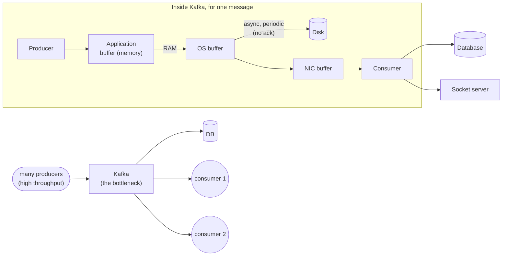
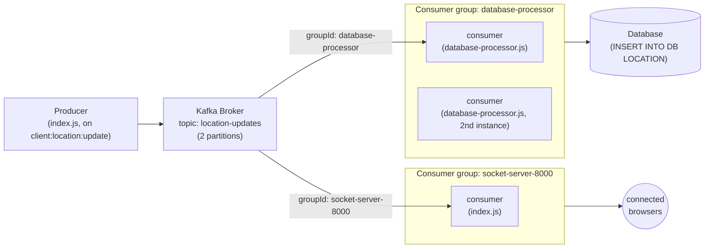

# Kafka — Event Streaming, Ordering, and High-Throughput Pipelines

> Code references in this note point to the real setup at `07-backend/setups/07-kafka-driver-location-setup` — a live-location-sharing map (like Uber/Ola's driver tracking), not a toy example.

---

## 1. Why the Checkbox Problem Didn't Need Kafka, But This One Does

In the 1,000,000-checkbox project (note 10), say 40,000 people are clicking at the same time, in the same second — a lot of input/output happening per second. The goal there was just to transfer *live* data, and Redis pub/sub was enough for that:

- If some data was lost, or a publish didn't emit to every instance, that wasn't a major problem — it was only live transmission. Someone refreshes, the real state (in Redis) is still correct.
- Order didn't matter either — who clicked first and who clicked last made no difference to the final grid.

That's why Kafka wasn't used there.

Now compare that to **stock market data**. There cannot be discrepancies — it has to always be in the correct, ordered sequence. If the price goes up, it should show going up; if it goes down, it should show going down. It can't arrive out of order, because a trade decision (buy/sell) depends on that exact sequence being right. So on top of high throughput, we now also need **proper ordering and sequencing**.

Same story in a **delivery/ride app**: if a rider has traveled A → B → C → D, and the update is emitted, the sequence matters. If the rider has already passed C, that location update should never be appended *after* a later point like E — it should always land in the correct sequence.

And from the socket layer, if we're storing something into the database every second — say, a driver's location — a plain `INSERT` query might work at small scale, but not at real scale. If seven lakh (700,000) operations hit the database directly, the database will go down, because it's ACID-compliant: it has to check atomicity, consistency, and so on for every single write, and that checking takes time. If seven lakh users hit that same path at once, it's gone.

Since a database is synchronous, every input/output operation there takes real time. If one lakh users show up at once, it goes off. So we need something in between — a **bottleneck** — that lets things through slowly, as a stream, instead of everything falling in at a single time. Think of a Coca-Cola or Pepsi bottle: wide at the bottom, but the neck is small, so it controls how much comes out and how fast. That bottleneck needs to itself be high-throughput, so that even if many users show up, it gives a response in a controlled manner — reading sequentially, writing sequentially, in a controlled way. That's what a high-throughput system is, and that's what **Kafka** gives us.

---

## 2. If Kafka Is So Well-Maintained and High-Throughput, Why Not Use It As the Main DB?

Kafka has a concept called a **producer**, which produces events. These events are stored in an **application-level buffer** — unlike a database, which stores things on disk, this buffer lives **in memory**.

From there, it goes into the **OS buffer** — basically RAM.

Then, **periodically and asynchronously**, it writes to **disk**.

It also copies into the **network interface buffer (NIC buffer)** — this OS-level buffer does its work asynchronously, but it doesn't give any acknowledgment about whether something was actually inserted or not — unlike a primary database, which updates first and only *then* gives you a response. The NIC is what forwards the data onward to consumers — this is how it reaches, say, a socket that then emits its own responses to connected clients.



### The durability trade-off

Now, say the disk crashes. Whatever was already written to disk can be recovered — read straight back from disk into the application's memory. But say, *while* something was being added to disk, some data was lost — that cannot be recovered, because it was never actually added to the disk in the first place. That's one of the trade-offs.

And if something in the socket path isn't there — that's not really a trade-off, that's just gone, and it's fine, because it was only meant for live transmission anyway.

So yes, we're able to achieve a high-throughput system, but the drawback is **durability isn't as strong**. It's not that durability is completely absent, but we have to trade off something, and that something is durability.

---

## 3. Why It's So Fast: the Append-Only Log

Kafka uses what's called an **AOL — append-only log**.

Here's the actual contrast with Redis. Redis, being a key-value store, has to allocate and look things up via hashing — go find where in memory a key lives, jump there, read or write it. That's a form of random-access lookup, and doing that lookup and allocation repeatedly is comparatively more work.

What Kafka does instead is closer to how an array works: the next write just goes at the **next slot**. There's no searching for where something should go — "the next allocation goes here, the next one goes right after it." Because Kafka never has to search for a place to put new data, memory allocation for writes is very fast — everything is sequential, one after another, purely by position, not by key.

**Redis** is called a **Remote DIctionary Server** — a key-value store, used to cache data and look it up by key. **Kafka** is not that kind of store at all — it's a **high-throughput streaming system**. So the difference isn't "which one uses the stack vs. the heap" (both are working in memory before anything touches disk) — the real difference is the **access pattern**: Redis does random-access lookup by key; Kafka does sequential append-and-read by position. That sequential nature is also *why* ordering falls out naturally on Kafka's side — messages are physically laid down one after another, so reading them back in that same order is the default behavior, not something you have to reconstruct.

---

## 4. Kafka Is a Message Broker

Kafka is a **message broker** — it sits between two sides:

1. **Producer side**
2. **Consumer side**

```
  producer ──send──► [ Kafka broker ] ──deliver──► consumer
```

Whenever you produce a message, Kafka says: *tell me the topic.*

Messages are organized by **topic**, and within a topic, by **partition** — `partition 0`, `partition 1`, `partition 2`, and so on. You give Kafka the message, typically in JSON format.

### 4.1 Setting up the client — `kafka-client.js`

Every producer and every consumer in this project shares one underlying client config, so there's a single connection definition:

```javascript
// kafka-client.js
import { Kafka } from 'kafkajs';

export const kafkaClient = new Kafka({
  clientId: 'chaicode',
  brokers: ['localhost:9092'],
});
```

### 4.2 "Migrating" Kafka — creating topics ahead of time

Just like a SQL database needs a migration to create tables before you can insert rows, a Kafka broker instance needs its **topics** (and partition counts) created before producers/consumers can use them. This is what `kafka-admin.js` does — it's the Kafka equivalent of running a migration:

```javascript
// kafka-admin.js
import { kafkaClient } from './kafka-client.js';

async function setup() {
  const admin = kafkaClient.admin();

  console.log(`Kafka Admin Connecting...`);
  await admin.connect();
  console.log(`Kafka Admin Connecting Success...`);

  await admin.createTopics({
    topics: [{ topic: 'location-updates', numPartitions: 2 }],
  });

  await admin.disconnect();
}

setup();
```

Run this once, the same way you'd run a migration before starting your app:

```bash
node kafka-admin.js
```

This creates the topic `location-updates` with **2 partitions** — meaning this topic's log is actually split into 2 independent, ordered logs, which is what lets two consumers in the same group later split the work (see §7).

### 4.3 Producing a message — inside `index.js`

The producer side of this project lives in the same `index.js` that also runs the Socket.IO server. When a connected browser emits its location, that gets turned into a Kafka message:

```javascript
// index.js
const kafkaProducer = kafkaClient.producer();
await kafkaProducer.connect();

socket.on('client:location:update', async (locationData) => {
  const { latitude, longitude } = locationData;

  await kafkaProducer.send({
    topic: 'location-updates',
    messages: [
      {
        key: socket.id, // same socket.id -> same partition -> stays in order
        value: JSON.stringify({ id: socket.id, latitude, longitude }),
      },
    ],
  });
});
```

`key: socket.id` is what decides the partition — the same key always hashes to the same partition, which is what keeps one rider's own updates strictly in order, even though the topic overall has 2 partitions being written to by many riders at once.

---

## 5. Now the Consumer Asks the Broker for a Message

The consumer asks Kafka for a message on a particular topic — here, `"location-updates"` (conceptually the same idea as "rider update"). Kafka gives back the update for that topic, in JSON, and the consumer does whatever it's responsible for with it — in this project, one consumer writes it to the database, and another pushes it out over a socket.

### 5.1 The socket-facing consumer — inside `index.js`

```javascript
// index.js
const kafkaConsumer = kafkaClient.consumer({
  groupId: `socket-server-${PORT}`,
});
await kafkaConsumer.connect();

await kafkaConsumer.subscribe({
  topics: ['location-updates'],
  fromBeginning: true,
});

kafkaConsumer.run({
  eachMessage: async ({ topic, partition, message, heartbeat }) => {
    const data = JSON.parse(message.value.toString());
    console.log(`KafkaConsumer Data Received`, { data });
    io.emit('server:location:update', {
      id: data.id,
      latitude: data.latitude,
      longitude: data.longitude,
    });
    await heartbeat();
  },
});
```

Every message that lands on `location-updates` gets picked up here and re-broadcast to every connected browser via Socket.IO, which is what moves the marker on the Leaflet map in `public/index.html`.

### 5.2 The database-facing consumer — `database-processor.js`

This is a **separate Node process**, with its own `groupId`, doing a completely different job — writing to the database instead of emitting over a socket:

```javascript
// database-processor.js
import { kafkaClient } from './kafka-client.js';

async function init() {
  const kafkaConsumer = kafkaClient.consumer({
    groupId: `database-processor`,
  });
  await kafkaConsumer.connect();

  await kafkaConsumer.subscribe({
    topics: ['location-updates'],
    fromBeginning: true,
  });

  kafkaConsumer.run({
    eachMessage: async ({ topic, partition, message, heartbeat }) => {
      const data = JSON.parse(message.value.toString());
      console.log(`INSERT INTO DB LOCATION`, data); // stand-in for a real DB insert
      await heartbeat();
    },
  });
}

init();
```

Run it as its own process, separate from `index.js`:

```bash
node database-processor.js
```

---

## 6. Horizontally Scaling a Consumer

Now say I want to horizontally scale this particular consumer, and I have four messages — 1, 2, 3, 4 — going to a consumer. If I add more consumers, Kafka will divide the messages appropriately: say messages 1 and 2 go to the first consumer, and 3 and 4 go to the next one.

Say these two consumers are both responsible for writing to the database. Meanwhile I also have a third server, responsible only for the Socket.IO connections. Technically, all three of these — the two DB writers and the socket server — are consumers to the same Kafka broker.

**Here's the problem:** Kafka, by default, doesn't know which consumer is "a socket" and which is "responsible for the database." If it just handed out message instances blindly across all three, it would pass every message to all three consumers — the top two would each insert into the database (fine), but a naive "divide messages across whatever's listening" model would leave the split inconsistent and not properly tracked between a group meant to duplicate (the socket layer, which *should* see everything) and a group meant to split the load (the DB writers, which should each see only their share).

**Consumer groups solve this.** The database servers get grouped into one club (one `groupId`), and the socket server is connected to a different club (a different `groupId`):

- For the DB group: if 4 messages come in, those 4 messages are divided **between** the two consumers in that group — say 2 each.
- For the socket group: those same 4 messages are **also** delivered to the socket group, independently, in full.

**Important:** consumers within a group are not divided *equally* by message count in some naive round-robin sense — they're divided **per partition**. Kafka assigns whole partitions to consumers within a group; a partition's messages always go to exactly one consumer in that group. That's why `location-updates` was created with `numPartitions: 2` (§4.2) — with 2 partitions, you can usefully scale the DB-writer group up to (at most) 2 active consumers before some of them sit idle with nothing assigned.



### Running it horizontally scaled — copy-paste commands

**Scale the DB-writer group to 2 consumers** — same `groupId`, so Kafka splits the 2 partitions between them, one each, no duplicate inserts:

```bash
# terminal 1
node database-processor.js

# terminal 2 (a second OS process, same groupId: "database-processor")
node database-processor.js
```

**Scale the socket-server layer to 2 ports** — note the `groupId` in `index.js` is `socket-server-${PORT}`, so a different `PORT` means a *different* group, each getting its own full copy of every message (this is intentional — each running instance's browser clients need to see everything, not a split):

```bash
# terminal 1
PORT=8000 node index.js

# terminal 2
PORT=9000 node index.js
```

On Windows PowerShell, set the env var separately instead of inline:

```powershell
$env:PORT=8000; node index.js
```
```powershell
$env:PORT=9000; node index.js
```

---

## 7. Quick Reference

| Term | One-line meaning |
|---|---|
| Producer | The side that sends messages into Kafka, addressed to a topic. |
| Topic | A named stream of messages (e.g. `location-updates`) that producers send to and consumers subscribe to. |
| Partition | One append-only log a topic is split into (`numPartitions: 2` here); order is guaranteed only *within* a partition. |
| Key | The field (`socket.id` here) Kafka hashes to pick a partition — same key always lands on the same partition, keeping that entity's events in order. |
| Append-only log (AOL) | Kafka's on-disk format — new messages only ever added at the end, like pushing into an array. No key lookup needed to write, unlike Redis's hash-table model. |
| Consumer | The side that reads messages from a topic. |
| Consumer group | A label (`groupId`) that tells Kafka "these consumers are one team" — messages are *split* (by partition) between consumers in the same group, but *fully duplicated* across different groups. |
| "Migration" (`kafka-admin.js`) | Creating topics/partitions ahead of time, the Kafka equivalent of a SQL migration creating tables. |
| Async disk flush | Kafka acknowledges a producer's write before it's necessarily durable on disk — the source of its throughput, and its one real durability trade-off vs. a database. |
| Bottleneck (the Coke-bottle analogy) | Kafka sits between high-volume producers and a slower, ACID-constrained database, absorbing bursts and releasing them at a pace the database can sustain. |

---

## 8. Zookeeper vs. KRaft — What's Actually Running Here

Classic Kafka deployments needed a separate system called **Zookeeper** running alongside the Kafka brokers. Zookeeper's job was cluster coordination: tracking which brokers are alive, electing a "controller" broker, storing topic/partition metadata, and handling leader election for partitions. It was a whole extra service you had to stand up, operate, and keep healthy just for Kafka to function.

**This setup does not run Zookeeper at all**, and if you go looking for it in `docker-compose.yml`, you won't find it:

```yaml
# docker-compose.yml
services:
  kafka:
    image: apache/kafka:4.2.0
    container_name: kafka
    ports:
      - '9092:9092'
    environment:
      KAFKA_NODE_ID: 1
      KAFKA_PROCESS_ROLES: 'broker,controller'
      KAFKA_CONTROLLER_QUORUM_VOTERS: '1@kafka:9093'
      KAFKA_LISTENERS: 'PLAINTEXT://0.0.0.0:9092,CONTROLLER://0.0.0.0:9093'
      KAFKA_ADVERTISED_LISTENERS: 'PLAINTEXT://localhost:9092'
      KAFKA_CONTROLLER_LISTENER_NAMES: 'CONTROLLER'
      KAFKA_LISTENER_SECURITY_PROTOCOL_MAP: 'CONTROLLER:PLAINTEXT,PLAINTEXT:PLAINTEXT'
      KAFKA_OFFSETS_TOPIC_REPLICATION_FACTOR: 1
      KAFKA_TRANSACTION_STATE_LOG_REPLICATION_FACTOR: 1
      KAFKA_TRANSACTION_STATE_LOG_MIN_ISR: 1
```

`KAFKA_PROCESS_ROLES: 'broker,controller'` is the tell — this single container plays **both** roles itself, using **KRaft** (Kafka Raft) mode, which is the modern replacement for Zookeeper built directly into Kafka. Instead of a separate Zookeeper cluster handling coordination, the Kafka brokers themselves run a Raft consensus protocol to elect a controller and track metadata — one less moving piece to operate. `KAFKA_CONTROLLER_QUORUM_VOTERS` (`1@kafka:9093`) is what defines which node(s) participate in that internal controller election; with a single-node dev setup, it's just this one broker voting for itself.

So: if you ever see Kafka tutorials mentioning a separate Zookeeper container, that's the old architecture. This project's `docker-compose.yml` is already on KRaft, so there's nothing more to install or run for coordination — the one `kafka` service does it all.

---

## 9. Sharing Your Local Demo — Cloudflare Tunnel (Aside, Not Part of Kafka)

This is unrelated to Kafka itself — it's just how you'd let someone else see your local map demo (`http://localhost:8000`) without deploying anywhere.

A **Cloudflare Tunnel** exposes a port on your machine through a public URL, tunneling requests from the internet back to your local server:

```bash
# one-time install (see cloudflare's docs for your OS package manager)
cloudflared tunnel --url http://localhost:8000
```

This prints a public `https://<random-name>.trycloudflare.com` URL. Anyone who opens it gets routed straight to your local `index.js` server — useful for letting someone else's phone (with real GPS) show up as a live marker on your map, without either of you touching a real deployment.

---

## 10. How This Connects Back to Redis

Both Redis pub/sub and Kafka solve "get an event from one place to many places," but for opposite priorities:

| | Redis pub/sub (note 10) | Kafka |
|---|---|---|
| Ordering | Not guaranteed, and for the checkbox feature, not needed | Guaranteed per-partition/per-key, and for stock/ride data, required |
| Durability if a message is missed | Fine — it's a live-only signal; the real state is re-readable from Redis directly | Messages persist in the log — a consumer that was down can catch up by reading from where it left off |
| Delivery model | Broadcast to every subscriber, no concept of "split the work" | Consumer groups — split (by partition) within a group, duplicated across groups |
| Best fit | High-frequency, order-independent, loss-tolerant fan-out (live cursors, checkbox toggles, presence) | High-throughput, order-sensitive, at-least-delivered streams (prices, location trails, anything feeding a database at volume) |

Neither replaces the other — they're reached for based on which of *order* and *loss-tolerance* the feature can and can't live without.
