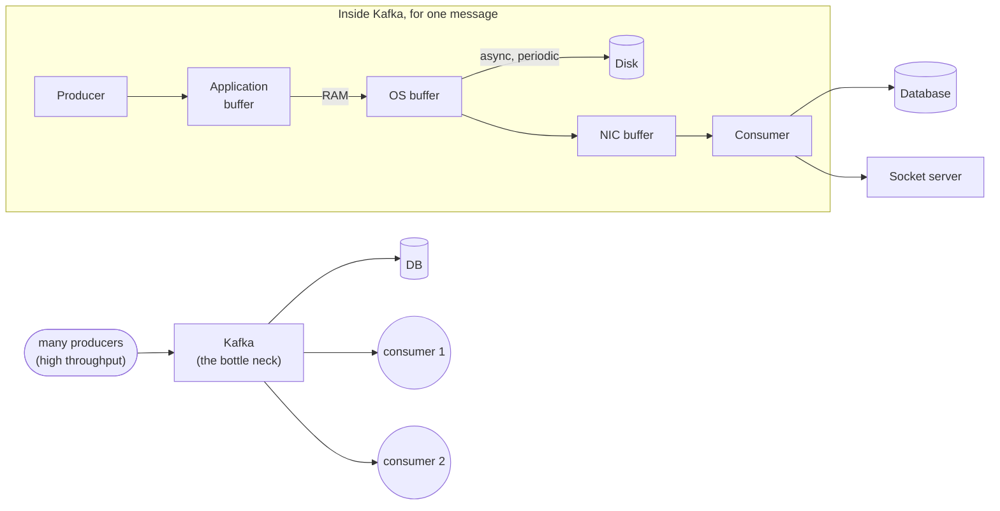
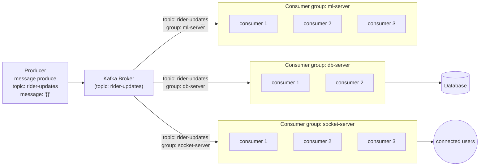

# Kafka — Event Streaming, Ordering, and High-Throughput Pipelines

---

## 1. Picking Up Where Redis Left Off

Note 10 solved a specific problem: **1,000,000 checkboxes, tens of thousands of people clicking at once.** The fix was Redis pub/sub — every server publishes a change, every server (including itself) receives it back, and the whole tree of server instances stays in sync.

That solution came with a tradeoff, and it was an *acceptable* one for that specific feature:

- If a publish is lost (server restarts mid-flight, a subscriber was briefly disconnected), **nothing bad happens**. The checkbox state in Redis is still correct — only the live broadcast of *that one change* might not have reached every screen instantly. Someone refreshes, they see the truth.
- **Order didn't matter.** If checkbox #4 got toggled before checkbox #900 on the wire, but arrived the other way around, nobody cares. Checking a box doesn't depend on any other box's history.

That's specific to *this* feature, not true of real-time systems in general. Two different feature shapes break both of those assumptions immediately:

- **Stock prices.** If a price moved ₹100 → ₹105 → ₹102, and a client's feed replays it as ₹100 → ₹102 → ₹105, a trade decision made on that feed is now based on a price history that never happened. Order isn't a nice-to-have here — it's the entire meaning of the data.
- **Ride tracking.** If a rider's path is A → B → C → D → E, and the location ping for D is somehow rendered on the map *before* C, the map just showed the rider teleporting backwards. The sequence *is* the feature.

Both also run at high throughput (every price tick, every few seconds of GPS ping, multiplied across every active trade or ride). So the requirement is no longer just "fan this out live" — it's **"fan this out live, in the exact order it happened, without silently dropping events, at high volume."** That combination — ordering + durability + throughput — is what Redis pub/sub was never built to guarantee, and what Kafka is built around.

---

## 2. Why Not Just Write Straight to the Database?

Before reaching for Kafka, it's worth asking: if a socket handler just inserted the driver's location into SQL every time a ping comes in, what actually breaks?

Say there are 700,000 active rides, each pinging its location once a second. That's 700,000 write operations landing on the database *every second*, continuously.

A relational database is **ACID-compliant** — every write has to satisfy Atomicity, Consistency, Isolation, and Durability before it can return success. That guarantee is exactly why you trust the database with money and state — but it's also not free. Enforcing it (taking locks, fsyncing to disk, maintaining consistency checks) takes real time per write. A database sized for "handle normal request traffic" was never sized for "accept 700,000 synchronous, ACID-checked inserts per second, forever." It falls over — not because the data was wrong, but because the write path itself can't be rushed past a certain point without breaking the guarantees that make it a database in the first place.

### The bottleneck idea

The fix isn't "make the database faster" — it's **don't let that much volume hit the database directly at once.** Think of a bottle of Coke or Pepsi: wide at the base, narrow at the neck. All the liquid is in there, but the neck only lets a controlled amount through per second, no matter how hard you tip the bottle. Nothing is lost — it's just regulated on the way out.

That's the shape of the fix here: put something **in between** the high-volume producers (every ride, every price tick) and the slow, guarantee-heavy consumer (the database) — something that can *absorb* bursts and *release* them into the database at a pace the database can actually sustain. That "something" is what a high-throughput message broker like Kafka is for.

---

## 3. If Kafka Is So Fast, Why Not Use It *As* the Database?

Natural next question: if Kafka can handle this volume so well, why bother with a database at all — why not just let Kafka be the system of record?

The answer is in *how* Kafka gets that speed, and what it gives up to get it.

### Where the data actually sits

When a **producer** sends a message, here's the real path it takes before anyone can call it "durable":

1. It first lands in an **application-level/producer-side buffer** — in memory, not on disk.
2. Kafka (the broker) accepts it into its own **in-memory buffer / page cache** on receipt.
3. **Asynchronously and periodically**, the broker flushes that buffer to **disk**, appending it to a log file.
4. Separately, the broker also needs to get the message out the door to consumers and to other replica brokers — this travels out through the OS's **network interface (NIC) buffer**, which is how "new data available" actually reaches a subscribed consumer or socket.

The key word in step 3 is **asynchronously**. Unlike a relational database, which — by design, because it's ACID — blocks and confirms "yes, this is safely committed" before returning success, Kafka's broker does **not** wait for step 3 to finish before acknowledging the producer (at the default/looser acknowledgment settings; stricter durability settings exist but cost throughput, which is the whole tradeoff). The write is accepted fast because the slow part — actually persisting it to disk — happens in the background, not in the critical path of "did my write succeed."

Here's the full path as a diagram — the bottleneck from §2, followed by where a message actually sits before it's durable:



Reading this left to right: many producers hit the narrow neck (Kafka) instead of the database directly. Inside Kafka, a single message goes producer → application buffer → OS buffer (RAM) — and from RAM it forks two ways: asynchronously and periodically to disk (durability, eventually), and immediately to the NIC buffer to go out to consumers (speed, right away). That fork is exactly the tradeoff in the next section: consumers can get a message before it's actually safe on disk.

### The tradeoff: throughput vs. durability

This is *exactly* the technique that makes Kafka so fast, and it's also its real weak point:

- If the broker process crashes **after** a message was flushed to disk, it's fine — recovery reads it straight back off disk into memory.
- If the broker crashes **before** that async flush happened — the message was sitting only in memory, never made it to disk — **it's gone.** Not recoverable, because it was never durably written anywhere in the first place.

That's a direct trade: Kafka buys throughput by not making every single write wait for a disk fsync + full ACID confirmation the way a database does. For a live location ping or a checkbox click, losing one in a crash window is a non-event — another one is coming in a second anyway. For "this is the one row that says a trade executed," that's not a trade you're allowed to make. **That's why Kafka sits in front of a database rather than replacing it** — it's the high-throughput neck of the bottle, not the bottle itself. The database remains the durable, ACID system of record; Kafka is what regulates the pace at which things reach it (and reach any other consumer, like a socket layer) without every single producer hitting the database directly.

---

## 4. Why Kafka's Writes Are So Fast: the Append-Only Log

Separate from the async-flush trick above, Kafka's *on-disk format itself* is built for speed in a way that's worth contrasting directly with Redis.

**Redis** is a key-value store — "REmote DIctionary Server." To read or write a key, it has to do a hash lookup: compute where that key lives among everything else currently in memory, jump there, read/write it. That's fast, but it's fundamentally *random access* — any key can be anywhere, and the engine has to find it each time.

**Kafka never does lookups like that for writing.** A Kafka topic-partition is physically an **append-only log** — conceptually just an ever-growing array on disk. A new message doesn't get "placed" anywhere based on its content; it simply goes **at the next sequential position**, the same way pushing to the end of an array doesn't require searching the array first. There's no key to hash, no existing entry to find and overwrite — just "whatever comes next goes right after whatever came last." Sequential writes like this are dramatically cheaper than random-access writes on real disks, which is a large part of why Kafka can sustain such high write throughput.

This is also *why* ordering falls out naturally on the Kafka side: since messages are physically laid down one after another in the order they arrive, reading them back in that same order is the default, not something you have to reconstruct afterward.

**So the real contrast isn't "stack vs. heap"** — both systems live primarily in memory before anything touches disk. The real contrast is **access pattern**: Redis gives you fast *random* access by key; Kafka gives you fast *sequential* append-and-read, which is what both its throughput and its ordering guarantee come from.

---

## 5. Kafka's Model: Producers, Topics, Partitions, Consumers

Kafka is a **message broker** — something that sits between producers of data and consumers of data, so the two sides never talk to each other directly.

```
  producer ──send──► [ Kafka broker ] ──deliver──► consumer
```

### 5.1 Topics

A producer doesn't just "send a message" — it sends a message **to a named topic**, e.g. `"rider-location-updates"` or `"stock-price-ticks"`. A topic is the named stream/category that groups related events together, the same role a channel plays in Redis pub/sub — except here the broker also keeps the messages (as the append-only log from §4), not just forwards them in passing.

```javascript
// producer.js — sending a rider location update
import { Kafka } from "kafkajs";

const kafka = new Kafka({
  clientId: "ride-tracking-service",
  brokers: ["localhost:9092"],
});

const producer = kafka.producer();
await producer.connect();

await producer.send({
  topic: "rider-location-updates",
  messages: [
    {
      key: rideId,              // see 5.2 — this decides the partition
      value: JSON.stringify({ rideId, lat, lng, timestamp: Date.now() }),
    },
  ],
});
```

### 5.2 Partitions — how a topic scales, and how ordering is actually guaranteed

A topic isn't one single log — it's split into **partitions** (`partition 0`, `partition 1`, `partition 2`, ...), each of which *is* one append-only log. This is what lets a topic handle more throughput than a single disk/process could alone — partitions can be spread across different brokers and consumed in parallel.

This raises the obvious question: if a topic is split into multiple independent logs, how is ordering (the whole point, from §1) preserved?

**Answer: Kafka only guarantees order *within* a single partition — never across partitions.** So the ordering guarantee you actually get is: "all updates for ride `abc123` land in the same partition and are read back in the exact order they were written." Which is exactly what you need — you never needed ride `abc123`'s updates to be globally ordered relative to some unrelated ride `xyz789`, only relative to *themselves*.

This is why every message is sent with a **key** (`key: rideId` in the snippet above). Kafka hashes the key to deterministically pick a partition — the same `rideId` always lands on the same partition, every time, which is what keeps that one ride's events in strict sequence. Pick the key to match whatever needs to stay ordered relative to itself: `rideId` for ride tracking, the stock's ticker symbol for price ticks, a `userId` for a per-user event stream.

```
topic: rider-location-updates
┌─────────────┐   ┌─────────────┐   ┌─────────────┐
│ partition 0 │   │ partition 1 │   │ partition 2 │
│ ride A: p1  │   │ ride B: p1  │   │ ride C: p1  │
│ ride A: p2  │   │ ride B: p2  │   │ ride C: p2  │
│ ride A: p3  │   │             │   │ ride C: p3  │
└─────────────┘   └─────────────┘   └─────────────┘
   (ride A's own pings are always in order here — ride A always hashes to partition 0)
```

### 5.3 Consumers

A consumer asks the broker for messages on a topic, the same way a subscriber in Redis asks for a channel:

```javascript
// consumer.js — a service that writes rider locations to the database
import { Kafka } from "kafkajs";

const kafka = new Kafka({ clientId: "location-writer", brokers: ["localhost:9092"] });
const consumer = kafka.consumer({ groupId: "location-db-writers" }); // see 5.4

await consumer.connect();
await consumer.subscribe({ topic: "rider-location-updates", fromBeginning: false });

await consumer.run({
  eachMessage: async ({ partition, message }) => {
    const update = JSON.parse(message.value.toString());
    await db.rideLocations.insert(update); // the database write happens here, paced by Kafka
  },
});
```

This is §2's bottleneck, made concrete: 700,000 rides can all produce pings per second straight into Kafka (which absorbs that easily via the in-memory buffer + append-only log from §3–4), while this consumer pulls messages out and writes to the database at whatever pace the database can actually sustain — without every ride ever touching the database directly.

### 5.4 The problem consumer groups solve

Here's a scenario worth walking through carefully, because the failure mode is non-obvious.

Say four messages arrive on a topic, and there are **three separate consumer processes** subscribed to it:

- Two of them are `location-writer` instances — their job is to insert each message into the database, horizontally scaled so between the two of them they can keep up with volume.
- The third is a totally different service — it's the Socket.IO layer, whose job is to push live updates to connected riders' apps, nothing to do with the database.

Naively, "subscribing to a topic" sounds like it should mean "give me the messages." But if Kafka just broadcast every message to every subscriber blindly — the same way Redis pub/sub fans out to every subscriber — that breaks the scaling goal immediately: **both** DB-writer instances would get **all four** messages, not two each, duplicating every insert. Kafka can't tell, on its own, "these two processes are redundant copies of the same job" vs. "this third process is doing something unrelated and also needs a full copy."

**Consumer groups are how you tell Kafka which of those two situations applies.** A consumer group is just a label (`groupId` in the snippet above) that says "these consumers are teammates doing the same job — split the work between them." Kafka's actual delivery rule is:

- **Within one consumer group**, each partition's messages go to exactly **one** consumer in that group — so scaling a group horizontally (adding more consumer instances) divides the load, it doesn't duplicate it.
- **Across different consumer groups**, each group gets its **own full, independent copy** of every message — because from Kafka's point of view, a different `groupId` is simply a different job entirely.

```
topic: rider-location-updates  (4 messages: m1, m2, m3, m4)

consumer group "location-db-writers"          consumer group "socket-broadcasters"
┌──────────────┐      ┌──────────────┐        ┌──────────────┐
│ writer #1    │      │ writer #2    │        │ socket server│
│ gets m1, m3  │      │ gets m2, m4  │        │ gets ALL of  │
│              │      │              │        │ m1,m2,m3,m4  │
└──────────────┘      └──────────────┘        └──────────────┘
   (work SPLIT within the group)                 (FULL copy — separate group)
```

So in the scenario above: give both DB-writer processes the **same** `groupId` (`location-db-writers`) — Kafka splits the four messages between them, two each, no duplicate inserts. Give the socket server a **different** `groupId` (`socket-broadcasters`) — it gets its own full stream of all four messages, completely independent of how the DB-writer group is scaled up or down. Each group's consumers are load-balanced *within* that group; the groups themselves don't share or compete for messages at all.

Here's the same idea generalized to three independent teams all reading the same topic — a DB-writing group, a socket-broadcasting group, and (say) a machine-learning pipeline group, each completely unaware of the others:



The producer doesn't know or care who's listening — it just sends to the topic. The broker is what fans a **full, independent copy** of every message out to each consumer group (`db-server`, `socket-server`, `ml-server`), and *within* each group, the broker splits that group's copy across however many consumer instances that group currently has. Scaling `socket-server` from 3 instances to 6 changes nothing about `db-server` or `ml-server` — the groups are fully isolated from each other, which is exactly what lets you add a brand-new consumer (like the `ml-server` group) later without touching any existing consumer's code.

---

## 6. Quick Reference

| Term | One-line meaning |
|---|---|
| Producer | The side that sends messages into Kafka, addressed to a topic. |
| Topic | A named stream of related messages (e.g. `rider-location-updates`) — like a Redis channel, but the broker also durably stores it. |
| Partition | One append-only log that a topic is split into; order is guaranteed only *within* a partition, never across partitions. |
| Key | The field (e.g. `rideId`) Kafka hashes to deterministically pick a partition — same key always lands on the same partition, which is what keeps its events in order. |
| Append-only log | Kafka's on-disk format — new messages are only ever added at the end, like pushing into an array. No key lookup needed to write, unlike Redis's hash-table model. |
| Consumer | The side that reads messages from a topic. |
| Consumer group | A label that tells Kafka "these consumers are teammates" — messages are *split* between consumers in the same group, but *fully duplicated* across different groups. |
| Async disk flush | Kafka acknowledges a producer's write before it's necessarily durable on disk — the source of its throughput, and its one real durability tradeoff vs. a database. |
| Bottleneck (the Coke-bottle analogy) | Kafka sits between high-volume producers and a slower, ACID-constrained database, absorbing bursts and releasing them at a pace the database can sustain. |

---

## 7. How This Connects Back to Redis

Both Redis pub/sub and Kafka solve "get an event from one place to many places," but they solve it for opposite priorities:

| | Redis pub/sub (note 10) | Kafka |
|---|---|---|
| Ordering | Not guaranteed, and for the checkbox feature, not needed | Guaranteed per-partition/per-key, and for stock/ride data, required |
| Durability if a message is missed | Fine — it's a live-only signal; the real state is re-readable from Redis directly | Messages persist in the log — a consumer that was down can catch up by reading from where it left off |
| Delivery model | Broadcast to every subscriber, no concept of "split the work" | Consumer groups — split within a group, duplicate across groups |
| Best fit | High-frequency, order-independent, loss-tolerant fan-out (live cursors, checkbox toggles, presence) | High-throughput, order-sensitive, at-least-delivered streams (prices, location trails, anything feeding a database at volume) |

Neither replaces the other — they're reached for based on which of *order* and *loss-tolerance* the feature can and can't live without.
