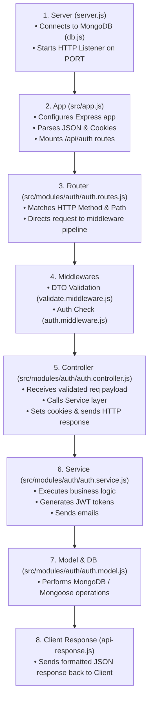
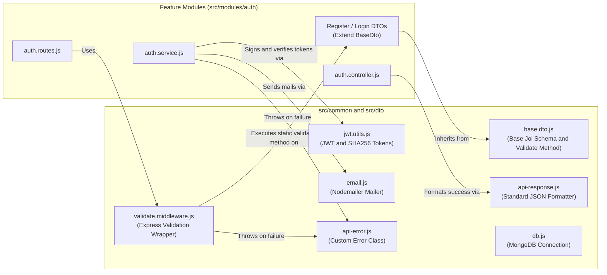

# Express Application Control Flow & Architecture

This document maps out the linear execution control flow of incoming HTTP requests and details the role of all common/shared modules in the repository.

---

## 1. Linear Control Flow (Server to Response)

When a request is received by the application, execution control flows sequentially through the following layers:



---

## 2. Shared & Common Modules Architecture

Common modules are non-feature-specific utilities located under `src/common/` and `src/dto/`. They exist to enforce **DRY (Don't Repeat Yourself)** principles, centralize cross-cutting concerns (validation, errors, responses, database, emails, JWT), and provide reusable tools for any feature module (`auth`, `cart`, etc.).



---

## 3. Comprehensive Breakdown of Common Modules

### **A. DTO & Validation Layer**

#### 1. [`src/dto/base.dto.js`](file:///c:/Users/mohammed-saif/Desktop/cohort/express-setup/src/dto/base.dto.js)
- **Where it exists**: `src/dto/base.dto.js`
- **Why it exists**: Serves as the base abstract class for all feature DTOs (`RegisterDto`, `LoginDto`, `ForgotPasswordDto`, `ResetPasswordDto`).
- **What it does**: Provides a static `validate(data)` method that executes `Joi.validate()` with options like `abortEarly: false` (collect all errors) and `stripUnknown: true` (sanitize unexpected inputs).

#### 2. [`src/common/middleware/validate.middleware.js`](file:///c:/Users/mohammed-saif/Desktop/cohort/express-setup/src/common/middleware/validate.middleware.js)
- **Where it exists**: `src/common/middleware/validate.middleware.js`
- **Why it exists**: Higher-order Express middleware function that bridges Express route handlers with DTO validation.
- **What it does**: Takes a DTO class (e.g. `validate(RegisterDto)`), calls `DtoClass.validate(req.body)`, replaces `req.body` with sanitized values on success, or throws an `ApiError.badRequest(...)` on failure.

---

### **B. Utilities & Helpers**

#### 3. [`src/common/utils/api-error.js`](file:///c:/Users/mohammed-saif/Desktop/cohort/express-setup/src/common/utils/api-error.js)
- **Where it exists**: `src/common/utils/api-error.js`
- **Why it exists**: Provides a unified, custom `ApiError` class extending native JavaScript `Error`.
- **What it does**: Includes static factory methods for clean error throwing:
  - `ApiError.badRequest(msg)` $\rightarrow$ Status 400
  - `ApiError.unauthorized(msg)` $\rightarrow$ Status 401
  - `ApiError.conflict(msg)` $\rightarrow$ Status 409
  - `ApiError.forbidden(msg)` $\rightarrow$ Status 412 / 403

#### 4. [`src/common/utils/api-response.js`](file:///c:/Users/mohammed-saif/Desktop/cohort/express-setup/src/common/utils/api-response.js)
- **Where it exists**: `src/common/utils/api-response.js`
- **Why it exists**: Guarantees consistent API response structures across all endpoints in the application.
- **What it does**: Provides helper methods for HTTP responses:
  - `ApiResponse.ok(res, message, data)` $\rightarrow$ Returns HTTP `200 OK` with JSON payload `{ success: true, message, data }`
  - `ApiResponse.created(res, message, data)` $\rightarrow$ Returns HTTP `201 Created`
  - `ApiResponse.noContent(res)` $\rightarrow$ Returns HTTP `204 No Content`

#### 5. [`src/common/utils/jwt.utils.js`](file:///c:/Users/mohammed-saif/Desktop/cohort/express-setup/src/common/utils/jwt.utils.js)
- **Where it exists**: `src/common/utils/jwt.utils.js`
- **Why it exists**: Centralizes JWT signing, verification, and cryptographic hash operations.
- **What it does**:
  - `generateAccessToken(payload)` / `verifyAccessToken(token)`
  - `generateRefreshToken(payload)` / `verifyRefreshToken(token)`
  - `hashToken(token)` (Uses Node.js `crypto` with `sha256` for database token security)
  - `generateResetToken()` (Generates raw random hexadecimal token and its SHA256 hash)

---

### **C. Infrastructure & Config**

#### 6. [`src/common/config/db.js`](file:///c:/Users/mohammed-saif/Desktop/cohort/express-setup/src/common/config/db.js)
- **Where it exists**: `src/common/config/db.js`
- **Why it exists**: Decouples database initialization from server listening logic.
- **What it does**: Connects Mongoose to the MongoDB URI specified in `process.env.MONGO_URI`.

#### 7. [`src/common/config/email.js`](file:///c:/Users/mohammed-saif/Desktop/cohort/express-setup/src/common/config/email.js)
- **Where it exists**: `src/common/config/email.js`
- **Why it exists**: Centralizes SMTP mail delivery logic using Nodemailer.
- **What it does**: Exports reusable mailers `sendVerificationEmail(email, token)` and `sendResetPasswordEmail(email, token)`.

---

## 4. Summary of Common vs Feature Directory Layout

```
src/
├── common/                  <-- SHARED CROSS-CUTTING LOGIC
│   ├── config/
│   │   ├── db.js            (MongoDB database connection)
│   │   └── email.js         (Nodemailer SMTP email dispatcher)
│   ├── middleware/
│   │   └── validate.middleware.js (Validation wrapper middleware)
│   └── utils/
│       ├── api-error.js     (Custom HTTP error class)
│       ├── api-response.js    (Standard JSON response formatter)
│       └── jwt.utils.js     (JWT signing & cryptographic hashing)
│
├── dto/                     <-- BASE DTO CLASS
│   └── base.dto.js          (Joi schema validation parent class)
│
└── modules/                 <-- FEATURE MODULES (DOMAIN LOGIC)
    └── auth/
        ├── dto/             (RegisterDto, LoginDto extending BaseDto)
        ├── auth.controller.js
        ├── auth.middleware.js
        ├── auth.model.js
        ├── auth.routes.js
        └── auth.service.js
```
