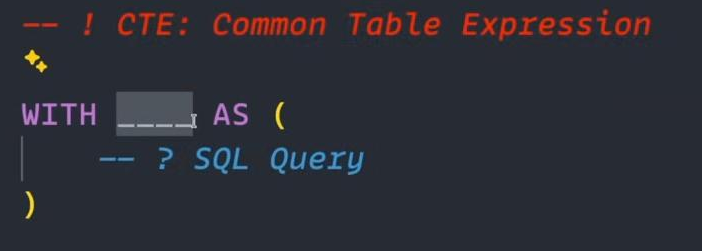

# Subqueries, CTEs & Window Functions — Explained From Scratch
## The three "advanced query" tools, one beginner-friendly walkthrough

> Previous: [13-Interview-Quick-Reference-Whats-Next.md](13-Interview-Quick-Reference-Whats-Next.md)

---

## Why this file exists

The earlier notes mention subqueries, CTEs, and window functions, but move fast. This file slows all the way down: what each one *is*, what problem it solves, and every example built on **one shared dataset** so you can actually follow the output row by row.

Read it top to bottom. Each section builds on the previous one:

| Tool | One-line intuition | Reach for it when… |
|---|---|---|
| **Subquery** | A query nested *inside* another query | You need a single value or a small list to filter/compare against, used once |
| **CTE** (`WITH`) | A named, temporary result you define once and reuse below | The same sub-result is needed 2+ times, or the query has become hard to read |
| **Window function** | A calculation *across a set of rows* that still returns **every row** | You need ranking, running totals, "compare each row to its group" — without collapsing rows |

---

## 🧱 The shared dataset (used by every example in this file)

```sql
CREATE TABLE students (
    student_id SERIAL PRIMARY KEY,
    name       VARCHAR(100),
    branch     VARCHAR(50)
);

CREATE TABLE exam_scores (
    exam_id    SERIAL PRIMARY KEY,
    student_id INT REFERENCES students(student_id),
    subject    VARCHAR(50),
    score      INT
);

CREATE TABLE projects (
    project_id SERIAL PRIMARY KEY,
    student_id INT REFERENCES students(student_id),
    title      VARCHAR(100),
    marks      INT
);

-- A report table we'll fill later with an INSERT ... SELECT
CREATE TABLE high_scorers_report (
    student_id   INT,
    student_name VARCHAR(100),
    subject      VARCHAR(50),
    score        INT
);
```

```sql
INSERT INTO students (name, branch) VALUES
('Rahul', 'CSE'),   -- id 1
('Sneha', 'IT'),    -- id 2
('Amit',  'ECE'),   -- id 3
('Priya', 'CSE'),   -- id 4
('Rohan', 'ME');    -- id 5

INSERT INTO exam_scores (student_id, subject, score) VALUES
(1, 'DBMS',    95),
(1, 'Maths',   88),
(2, 'DBMS',    72),
(2, 'Maths',   60),
(3, 'DBMS',    91),
(3, 'Maths',   45),
(4, 'DBMS',    98),
(4, 'Maths',   93),
(5, 'DBMS',    55);   -- Rohan has only one exam

INSERT INTO projects (student_id, title, marks) VALUES
(1, 'Chat App',        87),
(3, 'Compiler',        90),
(4, 'ML Model',        95),
(2, 'Portfolio Site',  70);   -- Priya has a project; Rahul/Amit too. Sneha's is low. Rohan has none.
```

```text
 student_id | name  | branch          avg(score) across ALL exam_scores rows
------------+-------+--------          = (95+88+72+60+91+45+98+93+55) / 9
          1 | Rahul | CSE             = 697 / 9  ≈  77.44
          2 | Sneha | IT
          3 | Amit  | ECE             Keep this number in your head — many
          4 | Priya | CSE             examples below compare against the
          5 | Rohan | ME              "class average" of ~77.44
```

> The **class average score is ≈ 77.44**. "Above average" rows: Rahul/DBMS (95), Rahul/Maths (88), Amit/DBMS (91), Priya/DBMS (98), Priya/Maths (93). Everything else is below.

---

# Part 1 — Subqueries

## 🧠 Core Analogy

A **subquery** is *a question you have to answer before you can answer the main question.*

> "Show me every exam score **above the class average**."

You can't filter until you know what the class average *is*. So the database runs the inner question first (`SELECT AVG(score) FROM exam_scores` → `77.44`), then uses that answer in the outer query (`WHERE score > 77.44`). The inner query is the **subquery**; it's wrapped in parentheses `( … )` and lives inside the outer (the **outer query**).

```
        OUTER QUERY (the real question)
        ┌───────────────────────────────────────────┐
        │ SELECT ... FROM exam_scores               │
        │ WHERE score >  ( SELECT AVG(score) ...  )  │  ← SUBQUERY runs first,
        │                └────────┬───────────────┘  │    produces one value (77.44),
        └─────────────────────────┼─────────────────-┘    then the outer query uses it
                                  ▼
                            77.44
```

## What a subquery *is* and *does*

- **Is:** a complete `SELECT` statement placed inside another statement, inside `( )`.
- **Does:** produces a value (or a set of values, or a whole temporary table) that the outer statement consumes.
- **Runs where:** in `WHERE`, in `HAVING`, in `SELECT` (as a computed column), in `FROM` (as a derived table), and inside `INSERT` / `UPDATE` / `DELETE`.

### The one rule to memorise

> **A subquery must return the right *shape* for where it's used.**

| Where it's used | Shape the subquery must return |
|---|---|
| Compared with `=`, `<`, `>`, `<=`, `>=` (a "scalar" spot) | **Exactly one column, exactly one row** → a single value |
| Compared with `IN` / `NOT IN` / `ANY` / `ALL` | **Exactly one column**, any number of rows → a list |
| Used in `FROM` | A full table (any columns, any rows) — and it **must be given an alias** |

And the type must match: if you compare `score` (an integer) to a subquery, that subquery must return a number — not text, not a date.

---

## 1a. Scalar subquery in `WHERE` — compare each row to one computed value

**Goal:** every score strictly *above* the class average.

```sql
SELECT
    s.name       AS student_name,
    s.branch     AS student_branch,
    e.subject,
    e.score
FROM exam_scores AS e
INNER JOIN students AS s ON s.student_id = e.student_id
WHERE e.score > (
    SELECT AVG(score) FROM exam_scores      -- returns ONE number: 77.44
);
```

```text
 student_name | student_branch | subject | score
--------------+----------------+---------+-------
 Rahul        | CSE            | DBMS    |    95
 Rahul        | CSE            | Maths   |    88
 Amit         | ECE            | DBMS    |    91
 Priya        | CSE            | DBMS    |    98
 Priya        | CSE            | Maths   |    93
(5 rows)
```

> The subquery `(SELECT AVG(score) FROM exam_scores)` returns a **single scalar** (77.44). That's why it can sit directly after `>`. If it returned two columns or many rows, Postgres would throw `more than one row returned by a subquery used as an expression`.

**Flip the comparison** for *below* average — same structure, just `<`:

```sql
SELECT
    s.name   AS student_name,
    s.branch AS student_branch,
    e.score
FROM exam_scores AS e
INNER JOIN students AS s ON s.student_id = e.student_id
WHERE e.score < (
    SELECT AVG(score) AS class_average
    FROM exam_scores
);
```

```text
 student_name | student_branch | score
--------------+----------------+-------
 Sneha        | IT             |    72
 Sneha        | IT             |    60
 Amit         | ECE            |    45
 Rohan        | ME             |    55
(4 rows)
```

> Naming the inner column `AS class_average` is harmless but **cosmetic** — nobody outside the subquery can see that name. The outer query only receives the *value*.

---

## 1b. Subquery with `IN` — filter against a *list*, not a single value

**Goal:** students who scored **≥ 90 in some exam** *and* also have a **project with marks ≥ 85**.

```sql
SELECT
    s.student_id, s.name, s.branch
FROM students AS s
WHERE s.student_id IN (
    SELECT student_id FROM exam_scores WHERE score >= 90     -- list of student_ids
) AND s.student_id IN (
    SELECT student_id FROM projects WHERE marks >= 85        -- another list of student_ids
);
```

```text
 student_id | name  | branch
------------+-------+--------
          1 | Rahul | CSE
          3 | Amit  | ECE
          4 | Priya | CSE
(3 rows)
```

> Each `IN ( … )` subquery returns **one column** (`student_id`) but **many rows** — that's a list. `s.student_id IN (list)` keeps a student if their id appears anywhere in that list. Two `IN` blocks joined by `AND` = "must satisfy both lists."

> ⚠️ Common bug: `SELECT * FROM projects WHERE marks >= 85` inside an `IN` would return **every column** of `projects`, and `student_id IN (multi-column-thing)` is a type mismatch. Inside `IN`, select **only the one column** you're matching on.

**Why not just `JOIN`?** You often could. `IN (subquery)` shines when you only want to *test membership* and don't want the extra columns (or the row duplication) a join brings.

---

## 1c. Subquery in `FROM` — a "derived table" (a.k.a. inline view)

Sometimes you need to **aggregate first, then join**. `GROUP BY` collapses rows, so you can't group *and* keep student names in the same simple query. Solution: do the grouping in a subquery, treat its result as a table, and join to it.

**Goal:** each student's **total score** and **number of exam attempts**, next to their name and branch.

```sql
SELECT
    s.name,
    s.branch,
    total_stats.total_score,
    total_stats.number_of_attempts
FROM (
    SELECT
        student_id,
        SUM(score)  AS total_score,
        COUNT(*)    AS number_of_attempts
    FROM exam_scores
    GROUP BY student_id
) AS total_stats                                     -- ← the derived table MUST have an alias
INNER JOIN students AS s ON s.student_id = total_stats.student_id;
```

```text
 name  | branch | total_score | number_of_attempts
-------+--------+-------------+--------------------
 Rahul | CSE    |         183 |                  2
 Sneha | IT     |         132 |                  2
 Amit  | ECE    |         136 |                  2
 Priya | CSE    |         191 |                  2
 Rohan | ME     |          55 |                  1
(5 rows)
```

> The subquery in `FROM` produces a **temporary 3-column table** (`student_id`, `total_score`, `number_of_attempts`), one row per student. We alias it `total_stats` and join `students` to it on `student_id`. Without the alias, Postgres errors with `subquery in FROM must have an alias`.

Same pattern with `AVG` instead of `SUM/COUNT`, joined into a bigger query:

```sql
SELECT
    s.name,
    s.branch,
    p.title,
    p.marks,
    exam_avg.avg_score
FROM projects AS p
INNER JOIN students AS s   ON s.student_id = p.student_id
INNER JOIN (
    SELECT
        student_id,
        AVG(score) AS avg_score
    FROM exam_scores
    GROUP BY student_id
) AS exam_avg ON exam_avg.student_id = p.student_id;
```

```text
 name  | branch | title          | marks | avg_score
-------+--------+----------------+-------+----------------------
 Rahul | CSE    | Chat App       |    87 | 91.5000000000000000
 Amit  | ECE    | Compiler       |    90 | 68.0000000000000000
 Priya | CSE    | ML Model       |    95 | 95.5000000000000000
 Sneha | IT     | Portfolio Site |    70 | 66.0000000000000000
(4 rows)
```

> This is three tables in one query: `projects`, `students`, and a **derived table** `exam_avg` computed on the fly. Rohan has a project row? No — he has no project, so he doesn't appear. Each `INNER JOIN` only keeps rows that match on both sides.

---

## 1d. Subquery for **insertion** — `INSERT INTO … SELECT …`

You don't always insert hand-typed values. You can insert **the result of a query** — copying/transforming rows from other tables into a target table.

**Goal:** fill `high_scorers_report` with every (student, subject, score) where the score beats the class average.

```sql
INSERT INTO high_scorers_report (
    student_id,
    student_name,
    subject,
    score
)
SELECT
    s.student_id,
    s.name,
    e.subject,
    e.score
FROM exam_scores AS e
INNER JOIN students AS s ON s.student_id = e.student_id
WHERE e.score > (
    SELECT AVG(score) FROM exam_scores
);
```

```text
INSERT 0 5
```

```sql
SELECT * FROM high_scorers_report;
```

```text
 student_id | student_name | subject | score
------------+--------------+---------+-------
          1 | Rahul        | DBMS    |    95
          1 | Rahul        | Maths   |    88
          3 | Amit         | DBMS    |    91
          4 | Priya        | DBMS    |    98
          4 | Priya        | Maths   |    93
(5 rows)
```

### The rules for `INSERT … SELECT`

1. **No `VALUES` keyword.** It's `INSERT INTO target (cols…) SELECT …` — you replace the `VALUES (…)` part entirely with a `SELECT`.
2. **Column order must line up.** The Nth column in your `INSERT` list receives the Nth column your `SELECT` produces. Here:

   | Position | `INSERT` column | `SELECT` expression | Type must match |
   |---|---|---|---|
   | 1 | `student_id` | `s.student_id` | INT ↔ INT ✅ |
   | 2 | `student_name` | `s.name` | VARCHAR ↔ VARCHAR ✅ |
   | 3 | `subject` | `e.subject` | VARCHAR ↔ VARCHAR ✅ |
   | 4 | `score` | `e.score` | INT ↔ INT ✅ |

   If you swapped `s.name` and `e.subject` in the `SELECT`, the insert would still *run* (both are text) but your report would have names in the `subject` column — a silent data bug.
3. **`INSERT 0 5`** means "0 OIDs, **5 rows inserted**" — the row count is the second number.
4. The `SELECT` can be arbitrarily complex — joins, `WHERE`, its own nested subqueries (like the `> AVG(...)` scalar subquery above). It's still "a subquery feeding an insert."

---

## Subqueries — Advantages

- **Concise and easy to write** for simple problems.
- **Read naturally** and are often intuitive to understand (*not* in complex queries).
- **Useful for filtering conditions or one-time calculations** — can be used in `SELECT`, `INSERT`, `UPDATE`, and `DELETE`.

## Subqueries — Disadvantages

- **Deeply nested subqueries become difficult to read** and harder to debug.
- **Logic may need to be repeated** if reused multiple times (CTEs are often preferred for better readability and reusability).
- **Complex business logic** is often easier to organize with CTEs.

> Notice the disadvantages all point the same direction: *the moment you're repeating a subquery or nesting it 3 levels deep, switch to a CTE.* That's Part 2.

---

# Part 2 — CTEs (Common Table Expressions)

## 🧠 Core Analogy

A **CTE** is *a named scratch result you define at the top, then use like a real table in the query below it.*

Think of a subquery as an ingredient you chop **inside the pot** while cooking — it works, but the recipe gets crowded. A CTE is chopping that ingredient **on its own board first**, labelling the bowl, and then just reaching for the bowl by name when you need it. Same food, far easier to follow — and if two dishes need the same chopped onion, you chop once.

```
WITH  <name>  AS (
    <a full SELECT — the "scratch bowl">
)
SELECT ...            ← the MAIN query. Uses <name> as if it were a table.
FROM <name>
```


`CTE` stands for **Common Table Expression**. "Common" = reusable, "Table Expression" = it behaves like a table. It exists **only for the duration of that one statement (basically like a variable in JS)** — nothing is saved to disk, and you can't `SELECT` from it in a later query.

## What advantage does a CTE have over a subquery?

Both compute the same intermediate result. The difference is **readability, reuse, and debuggability**:

| Subquery                                                      | CTE                                                             |
| ------------------------------------------------------------- | --------------------------------------------------------------- |
| Read **inside-out** — you hunt for the innermost `( )` first  | Read **top-to-bottom** — CTE first, then the query that uses it |
| Anonymous — no name to refer to                               | **Named** — `cls_avg`, `exam_toppers`… self-documenting         |
| If you need the same sub-result twice, you **write it twice** | Define once, **reference many times** below                     |
| Nesting 3+ deep becomes unreadable                            | Each CTE stays flat; chain them with commas                     |
| Hard to test in isolation                                     | **Run the CTE body alone** to see exactly what it returns       |

> Rule of thumb from Part 1: *the moment a subquery is repeated, or nested more than ~2 levels, convert it to a CTE.*

---

## 2a. The `WITH` blueprint (memorise this skeleton first)

```sql
-- ! CTE: Common Table Expression

WITH cte_name AS (
    -- ? any full SELECT query goes here
    SELECT ...
    FROM ...
    WHERE ...
)
SELECT ...              -- the MAIN query — required, comes right after the closing )
FROM cte_name;          -- use the CTE by name, like a table
```

Three things that trip up beginners:

1. **The CTE alone is not a runnable statement.** `WITH x AS (…)` *must* be followed by a `SELECT` (or `INSERT`/`UPDATE`/`DELETE`) that uses it. A `WITH` with no main query is a syntax error.
2. **The CTE body is just a normal `SELECT`** — any columns, joins, `WHERE`, `GROUP BY`, even `DISTINCT`.
3. **You still have to `FROM` / `JOIN` the CTE** in the main query. Naming it doesn't automatically pull its rows in.

---

## 2b. Single CTE — rewrite of "scores above class average"

Here's the Part 1a scalar subquery, redone as a CTE.

```sql
WITH cls_avg AS (
    SELECT AVG(score) AS class_average
    FROM exam_scores
)                                       -- cls_avg = a 1-row, 1-column table: | class_average | 77.44 |
SELECT
    s.name   AS student_name,
    s.branch AS student_branch,
    e.score,
    ca.class_average
FROM exam_scores AS e
INNER JOIN students AS s ON s.student_id = e.student_id
CROSS JOIN cls_avg AS ca                -- attach the single class_average value to every row
WHERE e.score > ca.class_average;
```

```text
 student_name | student_branch | score | class_average
--------------+----------------+-------+---------------------
 Rahul        | CSE            |    95 | 77.4444444444444444
 Rahul        | CSE            |    88 | 77.4444444444444444
 Amit         | ECE            |    91 | 77.4444444444444444
 Priya        | CSE            |    98 | 77.4444444444444444
 Priya        | CSE            |    93 | 77.4444444444444444
(5 rows)
```

> Same 5 rows as the subquery version in Part 1a — but now `class_average` is also a **visible column** in the output, because the CTE gave us a name (`ca.class_average`) to select. With the bare subquery `WHERE score > (SELECT AVG…)`, that number is used and thrown away.

### What is `CROSS JOIN`?

`CROSS JOIN` pairs **every row of the left table with every row of the right table** — a Cartesian product. No `ON` condition. If the left has 9 rows and the right has 4, you get 9 × 4 = 36 rows.

```
exam_scores (9 rows)   CROSS JOIN   cls_avg (1 row)   →   9 × 1 = 9 rows
```

That sounds dangerous, and usually it is — but here `cls_avg` has **exactly one row**, so `CROSS JOIN` just "staples" that single `class_average` value onto every exam row. It's the standard way to make one aggregate value available to every row for comparison.

> If `cls_avg` returned 3 rows, this `CROSS JOIN` would triple every exam row — a classic accidental-explosion bug. Only `CROSS JOIN` a CTE you *know* returns one row.

---

## 2c. Multiple CTEs — rewrite of the double-`IN` subquery

Part 1b asked: students who scored **≥ 90 in some exam** *and* have a **project with marks ≥ 85**. Two `IN` subqueries. As CTEs, each list gets a name:

```sql
WITH exam_toppers AS (
    SELECT DISTINCT student_id
    FROM exam_scores
    WHERE score >= 90
),                                  -- ← comma separates one CTE from the next
project_toppers AS (
    SELECT DISTINCT student_id
    FROM projects
    WHERE marks >= 85
)                                   -- ← NO comma after the last CTE
SELECT
    s.student_id,
    s.name,
    s.branch
FROM students AS s
INNER JOIN exam_toppers    AS et ON et.student_id = s.student_id
INNER JOIN project_toppers AS pt ON pt.student_id = s.student_id;
```

```text
 student_id | name  | branch
------------+-------+--------
          1 | Rahul | CSE
          3 | Amit  | ECE
          4 | Priya | CSE
(3 rows)
```

> Identical result to the double-`IN` subquery in Part 1b — but you can read the intent straight down: "exam toppers, project toppers, students who are in both."

### One `WITH`, many CTEs — the comma rule

You do **not** repeat `WITH` for each CTE. Write it **once**, then separate the CTEs with commas:

```sql
WITH first_cte AS (
    ...
),                       -- comma BETWEEN CTEs
second_cte AS (
    ...
),                       -- comma again
third_cte AS (
    ...
)                        -- NO comma after the final CTE
SELECT ... FROM first_cte JOIN second_cte ... ;   -- then the main query
```

| Mistake                                       | What happens                                               |
| --------------------------------------------- | ---------------------------------------------------------- |
| `WITH a AS (…) WITH b AS (…)`                 | Syntax error — only one `WITH` per statement               |
| Comma **after** the last CTE, before `SELECT` | Syntax error — `syntax error at or near "SELECT"`          |
| **Missing** comma between two CTEs            | Syntax error — parser expects `SELECT` after the first `)` |

A later CTE **can reference an earlier one** (e.g. `second_cte` can `SELECT ... FROM first_cte`), because they're read in order. The reverse is not allowed.

### Why `DISTINCT` inside the CTE?

Look at `exam_scores`: Rahul has **two** rows with `score >= 90`? Check the data — Rahul has DBMS 95 and Maths 88, so just one. But Priya has DBMS 98 **and** Maths 93 — **two** qualifying rows. Without `DISTINCT`, `exam_toppers` would contain `student_id = 4` **twice**:

```text
without DISTINCT          with DISTINCT
 student_id                student_id
-----------               -----------
         1                         1
         3                         3
         4    ← Priya               4
         4    ← Priya again
```

When you then `INNER JOIN` on `student_id`, that duplicate makes **Priya's row appear twice** in the final result. `SELECT DISTINCT student_id` collapses the CTE to one row per student, so the join stays clean. Rule: **if a CTE is just a list of IDs to match against, `DISTINCT` it.**

---

## 2d. Recursive CTEs (just so you've seen the name)

A CTE can refer to **itself** with `WITH RECURSIVE` — used for tree/hierarchy walking (org charts, category trees, "all comments under this comment"). Beginner-level: know it exists, know the keyword is `WITH RECURSIVE`, and that it has a *base* part `UNION ALL` a *recursive* part. Full treatment is out of scope here.

```sql
WITH RECURSIVE countdown AS (
    SELECT 5 AS n              -- base case
    UNION ALL
    SELECT n - 1 FROM countdown WHERE n > 1   -- recursive step
)
SELECT n FROM countdown;       -- 5, 4, 3, 2, 1
```

---

## CTEs — Advantages

- **Named and self-documenting** — the query reads like a list of steps.
- **Define once, reuse many times** in the same statement (no copy-pasted subquery logic).
- **Top-to-bottom readability** instead of inside-out nesting.
- **Debuggable** — run any CTE's body on its own to inspect its rows.
- **Chainable** — later CTEs can build on earlier ones.

## CTEs — Disadvantages

- **More verbose** for a one-off, trivial sub-result (a tiny scalar subquery is shorter).
- Historically an **optimization fence** in some databases (the CTE was always fully computed first). Modern Postgres (12+) can inline simple CTEs, but it's worth knowing.
- Still **scoped to one statement** — if you need the result reusable across many queries, that's a `VIEW`, not a CTE.

---

# Part 3 — Window Functions

<!-- TO BE FILLED FROM NEXT BATCH OF SCREENSHOTS -->
_Section pending — screenshots incoming._

---

# Part 4 — Subquery vs CTE vs Window Function: which one?

<!-- TO BE FINALISED ONCE PARTS 2 & 3 ARE DONE -->
_Comparison table pending._

---

**Next up:** back to [13-Interview-Quick-Reference-Whats-Next.md](13-Interview-Quick-Reference-Whats-Next.md) for the condensed Q&A.
