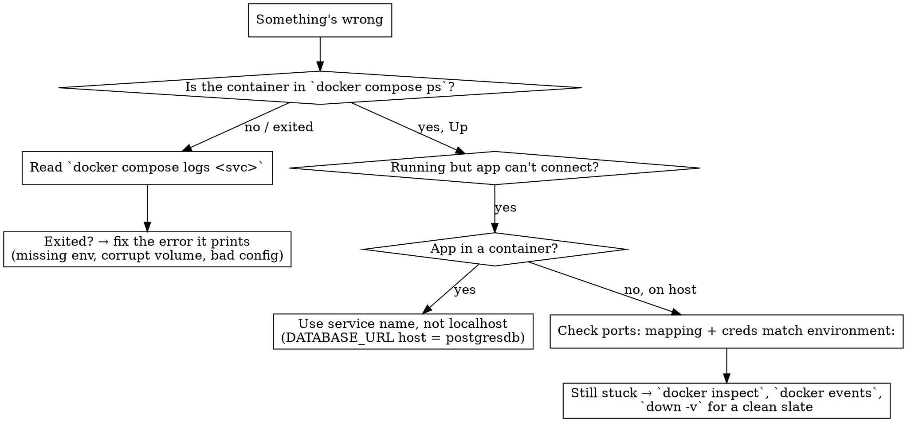

# Troubleshooting & Command Cheat Sheet
## Part 7 of 8 — Symptom → Cause → Fix, and Every Command in One Place

> Previous: [06-Networking-Between-Containers.md](06-Networking-Between-Containers.md)

---

## 📌 Executive Summary

- Most Docker problems for a backend dev fall into six buckets: **port already in use**, **container exits immediately**, **app can't connect to the DB**, **auth fails**, **env change had no effect**, and **disk full**.
- The first move for almost any container problem is **`docker compose logs <service>`** (or `docker logs <name>`). The error is nearly always printed there in plain text.
- **"How do I see running containers?"** → `docker ps` (running), `docker ps -a` (all, including exited), `docker compose ps` (just this project).
- **"Env change did nothing"** → database init vars only apply to an *empty* data volume. `docker compose down -v` then `up -d` to re-init (destroys data).
- Keep disk in check with `docker system df` and periodic `docker system prune` / `docker volume prune`.

---

## 🚑 1. Symptom → Cause → Fix

### `Bind for 0.0.0.0:5432 failed: port is already allocated`

| | |
|---|---|
| **Cause** | Another process (a system-installed Postgres, or another container) already holds host port 5432. |
| **Diagnose** | `docker ps` (another container on 5432?); Windows: `netstat -ano \| findstr :5432`; macOS/Linux: `lsof -i :5432`. |
| **Fix** | Stop the other user of the port, **or** change the **host** side of the mapping: `ports: ["5433:5432"]`, and update `DATABASE_URL` to port `5433` ([file 02](02-Ports-Environment-Variables.md)). |

### Container exits immediately (not in `docker ps`, shows `Exited (1)` in `docker ps -a`)

| | |
|---|---|
| **Cause** | The main process crashed on startup — a missing required env var, a bad config, a corrupted data dir, or the command finished (it wasn't a long-running process). |
| **Diagnose** | `docker compose logs <service>` / `docker logs <name>`. For Postgres a missing `POSTGRES_PASSWORD` prints `Database is uninitialized and superuser password is not specified`. |
| **Fix** | Add the missing var to `environment:`; if the data dir is corrupted, `docker compose down -v` (destroys data) then `up -d`. |

### App: `ECONNREFUSED 127.0.0.1:5432` / `connect ECONNREFUSED ::1:5432`

| | |
|---|---|
| **Cause** | Nothing is listening at that address from where the app is looking. Either the DB container isn't up yet, or the app is inside a container and using `localhost` (which means *itself*). |
| **Diagnose** | `docker compose ps` — is `postgresdb` `Up`? Is your app running in your terminal or as a Compose service? |
| **Fix** | If app runs **on your machine**: wait for the DB (or add a `healthcheck` + retry), confirm `ports:` maps 5432. If app runs **in a container**: change the host in `DATABASE_URL` from `localhost` to the **service name** `postgresdb` ([file 06](06-Networking-Between-Containers.md)). |

### App: `password authentication failed for user "postgres"`

| | |
|---|---|
| **Cause** | The credentials in `DATABASE_URL` don't match what the database actually has. Common when you edited `environment:` **after** the volume was already initialized — the old password is still baked into `pgdata`. |
| **Diagnose** | Compare `DATABASE_URL` user/password against compose `environment:`. Check whether `pgdata` predates your last change: `docker volume inspect <project>_pgdata`. |
| **Fix** | Make the two match. If you want the new `environment:` values to take: `docker compose down -v && docker compose up -d` (**destroys data** — dump first with `pg_dump` if it matters) ([file 03](03-Volumes-Data-Persistence.md)). |

### Changed `environment:` / init settings but nothing changed

| | |
|---|---|
| **Cause** | `POSTGRES_*` and `MONGO_INITDB_*` are read **only when the data directory is empty** (first init). An existing volume means init is skipped. |
| **Fix** | `docker compose down -v` then `docker compose up -d` to re-run init on a fresh volume (**destroys data**). |

### App connects but `database "cohort-db" does not exist`

| | |
|---|---|
| **Cause** | `POSTGRES_DB` was set *after* first init (so it was never created), or the DB name in the URL is misspelled, or the volume was created before you added `POSTGRES_DB`. |
| **Fix** | `docker compose exec postgresdb createdb -U postgres cohort-db`, **or** `down -v` + `up -d` to re-init with `POSTGRES_DB` set. |

### `Cannot connect to the Docker daemon`

| | |
|---|---|
| **Cause** | Docker Desktop / the Docker service isn't running. |
| **Fix** | Start Docker Desktop (Windows/macOS) or `sudo systemctl start docker` (Linux). Wait for the whale icon to settle. |

### Disk full / `no space left on device`

| | |
|---|---|
| **Cause** | Accumulated stopped containers, dangling images, unused volumes, build cache. |
| **Diagnose** | `docker system df` — shows reclaimable space per category. |
| **Fix** | `docker container prune` → `docker image prune -a` → `docker volume prune` (careful — deletes unused volumes) → `docker builder prune`. Or all at once: `docker system prune -a --volumes`. |

### Code changes don't show up in the running container

| | |
|---|---|
| **Cause** | The image was built with your code copied in (`COPY . .`); the container runs that snapshot. No bind mount = no live updates. |
| **Fix** | For dev, bind-mount source (`- ./src:/app/src`) + a watch command ([file 03](03-Volumes-Data-Persistence.md) §3, [file 05](05-Docker-Compose-Explained.md) §6). For a one-off, `docker compose up -d --build` to rebuild. |

### `docker compose up` says `service "api" has neither an image nor a build context`

| | |
|---|---|
| **Cause** | A service defines neither `image:` nor `build:`. |
| **Fix** | Add one. `image: postgres:17` for a prebuilt service, `build: .` to build a Dockerfile. |

### Windows: bind mount is empty / file changes not detected

| | |
|---|---|
| **Cause** | Project sits on a Windows path (`C:\...`) instead of the WSL 2 filesystem; file-change events don't cross the boundary reliably. |
| **Fix** | Put the project under your WSL 2 home (`\\wsl$\Ubuntu\home\you\...`) and run Docker/Compose from inside WSL. Big speed and reliability win. |

---

## 🔍 2. Diagnostic Commands (learn these first)

```bash
docker ps                          # running containers
docker ps -a                       # ALL containers (incl. exited) — where did it go?
docker compose ps                  # containers for THIS project only
docker compose logs                # all logs, this project
docker compose logs -f postgresdb  # follow one service's logs live
docker logs --tail 100 <name>      # last 100 lines of a specific container
docker inspect <name>              # full JSON: state, mounts, env, network, exit code
docker inspect <name> --format '{{.State.Status}} {{.State.ExitCode}} {{.State.Error}}'
docker compose exec postgresdb bash          # shell inside a running service
docker compose exec postgresdb psql -U postgres -d cohort-db   # straight into psql
docker compose exec mongodb mongosh                            # straight into mongosh
docker stats                       # live CPU / memory / net per container
docker system df                   # disk usage by images / containers / volumes / cache
docker events                      # live stream of daemon events (start, die, oom...)
```

---

## 📚 3. Full Command Cheat Sheet

### Images

```bash
docker images                      # list local images
docker pull postgres:17            # download an image
docker build -t my-api .           # build from ./Dockerfile, tag "my-api"
docker build -t my-api:1.0 --target runtime .   # build a specific stage
docker tag my-api my-api:stable    # add another tag
docker push myname/my-api:1.0      # upload (after docker login)
docker image inspect postgres:17   # metadata
docker history my-api              # layers and how they were made
docker rmi my-api                  # remove an image
docker image prune                 # remove dangling (untagged) images
docker image prune -a              # remove all images not used by a container
```

### Containers (raw `docker`, no Compose)

```bash
docker run -d --name pg -e POSTGRES_PASSWORD=x -p 5432:5432 \
  -v pgdata:/var/lib/postgresql/data postgres:17
docker ps                          # running
docker ps -a                       # all
docker start pg / docker stop pg / docker restart pg
docker rm pg                       # remove a stopped container
docker rm -f pg                    # force stop + remove
docker logs -f pg                  # follow logs
docker exec -it pg bash            # shell inside
docker exec -it pg psql -U postgres
docker cp pg:/etc/postgresql/postgresql.conf ./   # copy a file out of a container
docker cp ./seed.sql pg:/seed.sql                 # copy a file in
docker inspect pg
docker container prune             # remove all stopped containers
docker stats pg
docker top pg
```

### Compose

```bash
docker compose up -d               # create + start (detached) — daily driver
docker compose up                  # attached; streams logs; Ctrl+C stops
docker compose up -d --build       # rebuild build: images first
docker compose up -d postgresdb    # just one service
docker compose down                # stop + remove containers & network
docker compose down -v             # ...and delete named volumes (WIPES DB DATA)
docker compose down --rmi local    # ...and remove images built by this project
docker compose stop / start / restart [svc]
docker compose ps [-a]             # this project's containers
docker compose logs -f [svc]       # follow logs
docker compose exec <svc> <cmd>    # run in a RUNNING service container
docker compose run --rm <svc> <cmd>   # run in a fresh one-off container
docker compose build [svc]         # build without starting
docker compose pull                # pull latest for all image: refs
docker compose config              # print the resolved, validated config
docker compose -f docker-compose.yml -f docker-compose.prod.yml up -d
```

### Volumes

```bash
docker volume ls                   # list volumes
docker volume inspect <name>       # mountpoint, driver, labels
docker volume create <name>        # create explicitly
docker volume rm <name>            # remove one (must be unused)
docker volume prune                # remove all volumes not used by a container
```

### Networks

```bash
docker network ls                  # list networks
docker network inspect <name>      # attached containers, subnet
docker network create <name>       # create standalone network
docker network connect <net> <container>
docker network disconnect <net> <container>
docker network prune               # remove unused networks
```

### System / cleanup

```bash
docker system df                   # what's using disk
docker system prune                # stopped containers + dangling images + unused networks + build cache
docker system prune -a             # ...also images not used by ANY container
docker system prune -a --volumes   # ...also unused volumes (aggressive)
docker builder prune               # just the build cache
docker login / docker logout
docker version / docker info
```

### Inside a DB container — the ones you'll use

```bash
# Postgres
docker compose exec postgresdb psql -U postgres -d cohort-db
docker compose exec postgresdb pg_isready -U postgres
docker compose exec -T postgresdb pg_dump -U postgres cohort-db > backup.sql
cat backup.sql | docker compose exec -T postgresdb psql -U postgres -d cohort-db

# Mongo
docker compose exec mongodb mongosh "mongodb://localhost:27017/cohort"
docker compose exec -T mongodb mongodump --archive --db=cohort > dump.archive
docker compose exec -T mongodb mongorestore --archive < dump.archive
```

---

## 🧭 4. A Decision Flow for "It's Broken"



---

## ✅ Takeaways

- **`docker compose logs <service>` first** — the error is almost always there in plain English.
- **See containers:** `docker ps` (running), `docker ps -a` (all), `docker compose ps` (this project).
- **Port clash** → change the host side of `ports:` and update the URL. **Exits instantly** → missing env or corrupt volume, read logs. **Can't connect** → DB not up, or app-in-container using `localhost` instead of the service name.
- **Auth fails / env change ignored** → old credentials are baked into the volume; `docker compose down -v && up -d` re-inits (destroys data — dump first if it matters).
- **Disk full** → `docker system df`, then `docker system prune` / `docker volume prune`.
