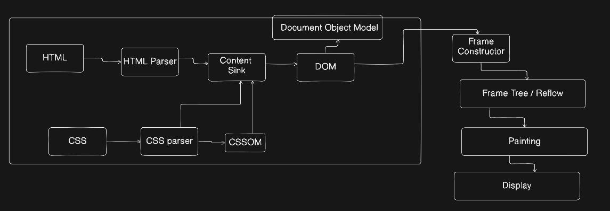
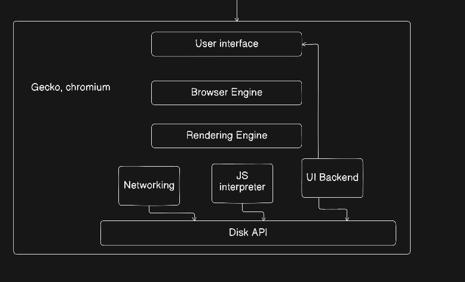

# HTML Class — 24-01-2026

## Laws

**Visual Impairment** (inability to see) — different laws in Europe and India.
- Europe: **all websites** must be accessible
- India: **only government websites** must be accessible

**GDPR Compliance (EU Rule)**
*(GDPR = General Data Protection Regulation)*
- A set of rules designed to give individuals more control over their personal data
- Essentially a "bill of rights" for the internet age
- GDPR covers general data privacy for everyone

**HIPAA Compliance**
*(HIPAA = Health Insurance Portability & Accountability Act)*
- A US law specifically focused on medical and health information
- Ex: it's the reason a doctor can't share your medical records with your boss or a random telemarketer without your permission

---

## Browser

- Important: **URL bar** (Uniform Resource Locator) — e.g. `https://google.com`
- **User Interface (UI)**
- **Browser Engine** — e.g. Blink, WebKit, Gecko
  - Takes raw code (HTML, CSS & JavaScript) and turns it into the interactive visual webpage you see on your screen
- **Rendering Engine**
  - Part of the browser engine responsible for visual "painting" of the website
  - If the browser engine is the "manager" of the whole process, the rendering engine is the artist that draws the pixels on your screen based on instructions it receives

**Browser architecture diagram:**

```
                     Rendering Engine
                           ↑
        ┌──────────────────┼──────────────────┐
   Networking          JS Interpreter       UI Backend
        ↑                   ↑
        └───────────────────┴──────┐
                                Disk API
                            (Local Storage)
                    The data you write, e.g. cookies
```

---

## HTML/CSS File Called as a Document

**Full pipeline diagram:**

```
                UI
                 ↓
          Browser Engine
                 ↓
          Rendering Engine
        ↙        ↓         ↘
  Networking   JS Interpreter   UI Backend
        ↘        ↓         ↙
              Disk API
```

**DOM = Document Object Model**
HTML + CSS are documents that make up the model → structure.

**Parsing flow:**

```
URL hit in the      →  HTML  →  HTML Parser ─┐
browser                                       ├→ transfer → Content Bulk
                     →  CSS   →  CSS Parser ──┘   (like a container that
                                    ↓                stores HTML/CSS place)
                                 CSSOM
                                                        ↓
                                                       DOM (Document Object Model)
                                                        ↓
                                                Frame Constructor
                                                        ↓
                                                 Frame Tree / Reflow
                                                        ↓
                                                     Painting
                                                        ↓
                                                     Display
```

**Parser example (expression parsing / parse tree):**
`1 + 2 * 3`

```
        +
       / \
      1   *
         / \
        2   3
```

**BODMAS Rule** (equation math rule)
Bracket ⇒ Order of Power ⇒ Division ⇒ Multiplication ⇒ Addition ⇒ Subtraction

---

## Fancy Words
- **Render** = Display
- **Parser** = transfer

**Web Parsing:**

```
                Web Parsing
               /            \
        Conventional     Un-conventional
             |                  |
          CSS & JS            HTML
   (CSS & JS throw errors)  (HTML doesn't throw errors)
```

⭐ **Strict HTML** (People try to convert HTML into an error-throwing language) → **HTML-4**

⭐ **DNS lookup / Network**

⭐ **JS Interpreter** — V8 engine, Bun

---

## WWW

**WWW = World Wide Web — URL**
`http://203.4.5/<file name>`
e.g. `chaicode.com`

**Request/response diagram:**

```
  [User]  ──── Request ────→  [.  ]
  [User]  ←──── Text ───────  [.  ]

                              Text files: Text, Image, JSON, File, Video
```

- Giving access to a **doc server** is hard.
- **Tim Berners-Lee** — inventor of WWW

**HTML**
- Look Good?
- Structure
- Capability of linking pages easily

---

## Domain / HTML Page Example

`chaicode.com/contact-us`
- **Domain name**: `chaicode.com`
- **HTML Page**: `/contact-us`

**HTML is a language of tags.**

| Type | Tags |
|---|---|
| Heading tag | `<h1><h2>...<h6>` |
| Paragraph tag | `<p>` |
| Self-closing tag | `<br> <hr> ` |

**Commonly used tags:**
`H1...H6`, `P`, `Img`, `Div`, `A`, `Video`, `HR`, `BR`, `Input`

**HTTP Header example:**
```
Header {
  Content-Type: text/html
}
```
→ Server tells browser "this is an HTML file"

- The server that returns HTML is called a **web server**.

**Diagram:**
```
WWW - Standard         →  www.chaicode.com
HTTP                       WWW server tags to the web server
HTML                       who has the landing page of HTML
URL Structure
                        → Redirect → chaicode.com
```

---

**Notes:** A few words were ambiguous in the original handwriting — e.g. "URL bar" locator wording, "Gecko" browser engine name — and some faint erased/overwritten lines bleeding through from adjacent pages were omitted as illegible or irrelevant.


